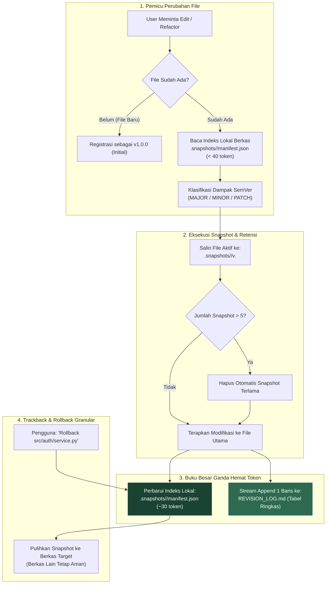
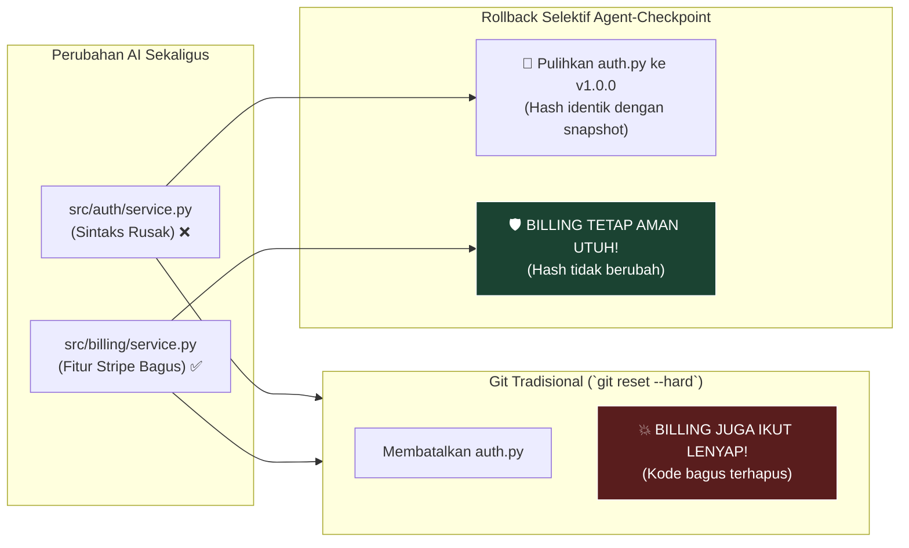
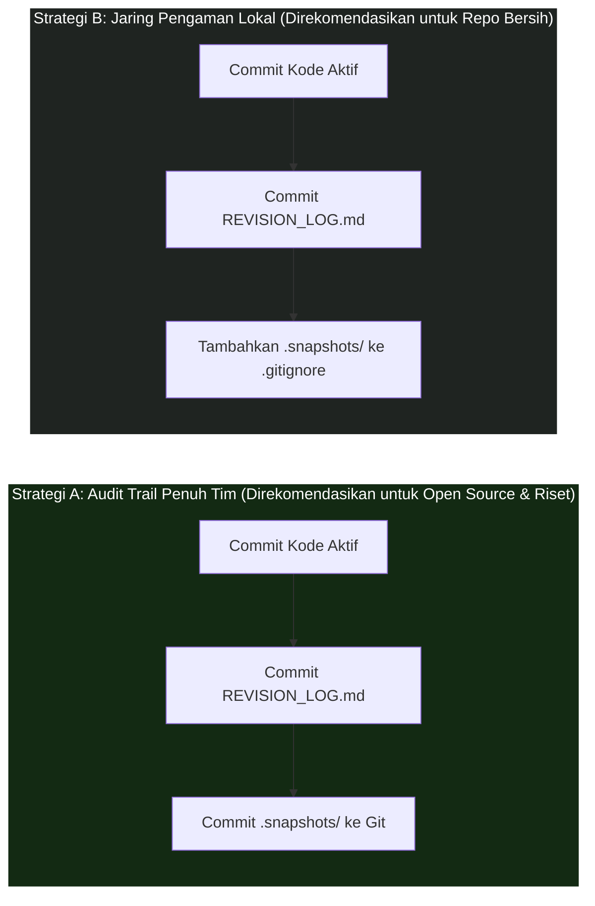

<div align="center">

# 🛡️ Agent-Checkpoint v2.0 (Turbo)

**Pencadangan file pra-edit tanpa kehilangan data, isolasi folder berkas, pemangkasan retensi cerdas, dan efisiensi token hingga 80% untuk AI coding & riset otonom.**

[]()
[]()
[](./LICENSE)
[]()
[]()

---

**Pilihan Bahasa:**  
[🇬🇧 English](./README.md) • [🇮🇩 Bahasa Indonesia (Aktif)](./README.id.md)

---

</div>

## ⚡ Masalah: AI Menimpa File Secara Destruktif & Pemborosan Token

AI coding agent otonom (Cursor, Claude Code, Google Antigravity, Windsurf, GitHub Copilot, Aider) semakin mempercepat pengembangan software. Namun, hampir semua AI memiliki 2 kelemahan bawaan:
1. **Penimpaan File Destruktif:** AI menimpa file secara langsung tanpa menyimpan riwayat sebelumnya, berisiko menghapus fungsi penting saat terjadi halusinasi.
2. **Pemborosan Token:** Sistem pencatatan riwayat biasa sering memaksa AI membaca ulang ratusan baris log masa lalu, membakar token API mahal pada setiap kali edit.

---

## 💡 Solusi: Protokol Agent-Checkpoint v2.0 Turbo

**Agent-Checkpoint v2.0** menyelesaikan kedua masalah tersebut melalui protokol *zero-dependency* yang ultra-ringan. Selain menjamin keselamatan kode, v2.0 memperkenalkan **Isolasi Folder per Berkas (*Hierarchical Bucketing*)**, **Retensi Jendela Geser ($K \le 5$)**, dan **Manifest Lokal Terisolasi** yang memangkas penggunaan token hingga **80%**.

---

## 🌟 Keunggulan Utama v2.0

### 1. 🛡️ Keamanan Mutlak (Nol Data Hilang)
Sebelum mengedit file, AI secara otomatis menyalin versi utuh sebelumnya ke `.snapshots/<filepath>/v<OLD_VERSION>.<ext>`. Kode dan dokumen Anda tidak akan pernah tertimpa tanpa jejak.

### 2. 📁 Struktur Direktori Rapi (*Hierarchical Bucketing*)
Tidak ada lagi penumpukan ratusan file di satu folder. Setiap berkas yang dimodifikasi memiliki ruang arsip terisolasinya sendiri (misal: `.snapshots/auth_service.py/`).

### 3. 🔄 Batas Retensi Otomatis ($K = 5$ Versi Maksimal)
Setiap berkas hanya menyimpan maksimal **5 versi snapshot terakhir**. Ketika versi ke-6 dibuat, versi terlama otomatis dihapus. Kapasitas penyimpanan Anda selalu terkunci dan tidak pernah membengkak.

### 4. ⚡ Hemat Token 80% (*Sharded Local Manifest*)
AI tidak lagi memindai seluruh riwayat proyek. AI hanya membaca indeks lokal kecil (`.snapshots/<filepath>/manifest.json`) yang hanya menghabiskan **kurang dari 40 token**. Riwayat dicatat sebagai baris tabel ringkas 1-baris tanpa membaca log masa lalu.

---

## 🏗️ Arsitektur: Pipeline v2.0 Turbo



---

## 🔰 Panduan Pemula (Pemasangan 30 Detik)

Pemasangan tidak memerlukan konfigurasi rumit maupun perintah terminal. Cukup gunakan metode *drop-in file*.

### Cara 1: Menggunakan File Explorer (Paling Mudah)
1. Buka folder [`adapters/`](./adapters) di repositori ini.
2. Pilih 1 file yang sesuai dengan aplikasi AI Anda:
   * **Cursor IDE:** Salin [`.cursorrules`](./adapters/.cursorrules) ke root proyek, atau salin [`agent-checkpoint.mdc`](./adapters/agent-checkpoint.mdc) ke dalam `.cursor/rules/` (Cursor 0.40+)
   * **Claude Code:** Salin file [`CLAUDE.md`](./adapters/CLAUDE.md)
   * **Google Antigravity / Gemini CLI:**
     - **Tingkat Proyek (Project Scope):** Salin [`adapters/AGENTS.md`](./adapters/AGENTS.md) ke root proyek Anda.
     - **Tingkat Global PC (Direkomendasikan):** Tambahkan isi [`adapters/AGENTS.md`](./adapters/AGENTS.md) ke `~/.gemini/AGENTS.md` (otomatis melindungi semua proyek di laptop Anda!).
     - **Tingkat Native Skill:** Salin [`SKILL.md`](./SKILL.md) ke folder skill Antigravity Anda (`.agents/skills/agent-checkpoint/SKILL.md` atau `~/.gemini/config/plugins/.../skills/agent-checkpoint/`).
   * **Windsurf (Cascade):** Salin file [`.windsurfrules`](./adapters/.windsurfrules)
   * **GitHub Copilot:** Salin file [`copilot-instructions.md`](./adapters/copilot-instructions.md) ke folder `.github/`
3. Tempel (*paste*) file tersebut ke folder root proyek Anda.
   > [!NOTE]
   > Jika Anda sudah memiliki file aturan sebelumnya (seperti `AGENTS.md` atau `CLAUDE.md`), jangan replace file tersebut. Cukup buka kedua file dan salin isi aturan Agent-Checkpoint ke baris paling bawah.
4. **Selesai!** AI di aplikasi Anda sudah otomatis terlindungi.

---

### Cara 2: Menggunakan Terminal (Perintah 1-Baris)
Jalankan perintah ini di dalam root proyek Anda:

> [!TIP]
> **Sudah punya file aturan sebelumnya?** Gunakan perintah **Append (`>>` / `Add-Content`)** di bawah agar instruksi lama Anda tetap utuh! Jika proyek baru kosong, gunakan perintah **Fresh Install (`-o`)**.

* **Cursor IDE:**
  ```bash
  # Rekomendasi: Modern Isolated Rule (.cursor/rules/*.mdc) - Tidak pernah menimpa aturan lama:
  mkdir -p .cursor/rules && curl -o .cursor/rules/agent-checkpoint.mdc https://raw.githubusercontent.com/ainullm/agent-checkpoint/main/adapters/agent-checkpoint.mdc

  # Mode Classic .cursorrules (Append / Gabungkan ke file lama):
  curl -s https://raw.githubusercontent.com/ainullm/agent-checkpoint/main/adapters/.cursorrules >> .cursorrules

  # Mode Classic .cursorrules (Proyek baru kosong):
  curl -o .cursorrules https://raw.githubusercontent.com/ainullm/agent-checkpoint/main/adapters/.cursorrules
  ```
* **Claude Code:**
  ```bash
  # Proyek lama (Append tanpa menimpa isi lama):
  curl -s https://raw.githubusercontent.com/ainullm/agent-checkpoint/main/adapters/CLAUDE.md >> CLAUDE.md

  # Proyek baru (Buat baru):
  curl -o CLAUDE.md https://raw.githubusercontent.com/ainullm/agent-checkpoint/main/adapters/CLAUDE.md
  ```
* **Google Antigravity / Gemini CLI:**
  ```bash
  # Khusus proyek aktif (Append ke AGENTS.md yang sudah ada - Direkomendasikan):
  # Linux/macOS:
  curl -s https://raw.githubusercontent.com/ainullm/agent-checkpoint/main/adapters/AGENTS.md >> AGENTS.md
  # Windows PowerShell:
  Add-Content -Path "AGENTS.md" -Value (Invoke-RestMethod "https://raw.githubusercontent.com/ainullm/agent-checkpoint/main/adapters/AGENTS.md")

  # Khusus proyek aktif (Proyek baru tanpa AGENTS.md sebelumnya):
  curl -o AGENTS.md https://raw.githubusercontent.com/ainullm/agent-checkpoint/main/adapters/AGENTS.md

  # Global untuk seluruh proyek di komputer Anda (Append):
  # Linux/macOS:
  curl -s https://raw.githubusercontent.com/ainullm/agent-checkpoint/main/adapters/AGENTS.md >> ~/.gemini/AGENTS.md
  # Windows PowerShell:
  Add-Content -Path "$HOME\.gemini\AGENTS.md" -Value (Invoke-RestMethod "https://raw.githubusercontent.com/ainullm/agent-checkpoint/main/adapters/AGENTS.md")
  ```
* **Windsurf:**
  ```bash
  # Proyek lama (Append tanpa menimpa):
  curl -s https://raw.githubusercontent.com/ainullm/agent-checkpoint/main/adapters/.windsurfrules >> .windsurfrules

  # Proyek baru (Buat baru):
  curl -o .windsurfrules https://raw.githubusercontent.com/ainullm/agent-checkpoint/main/adapters/.windsurfrules
  ```

---

## 🎮 Panduan Penggunaan Lengkap & Skenario Nyata

Setelah file adapter terpasang, **tidak ada perintah CLI atau sintaks khusus yang perlu Anda hafalkan**. Anda dapat berinteraksi dengan AI secara natural seperti biasa. Berikut adalah 4 alur kerja (*workflows*) inti yang mendemonstrasikan penggunaan sehari-hari, pencegahan bentrok nama file, dan pembuktian *selective rollback*:

---

### Alur Kerja 1: Penambahan Fitur & Refaktorisasi Sehari-hari

**Perintah (Prompt) yang Anda Berikan ke AI:**
> *"Tolong refactor fungsi autentikasi di `src/auth/service.py` agar mendukung JWT refresh token, tambahkan rate limiting dengan Redis, dan perbaiki penanganan error."*

**Yang Dilakukan AI Secara Otomatis di Balik Layar:**
1. **Memeriksa Status Berkas:** Mendeteksi bahwa `src/auth/service.py` sudah ada pada versi `v1.0.0`.
2. **Membuat Snapshot Pra-Edit:** Menyalin `src/auth/service.py` $\to$ `.snapshots/src/auth/service.py/v1.0.0.py`.
3. **Mengklasifikasikan Dampak SemVer:** Mengevaluasi perubahan. Karena menambahkan fitur baru tanpa merusak antarmuka lama, AI mengkategorikannya sebagai `MINOR` ($\to$ `v1.1.0`).
4. **Menerapkan Modifikasi & Memangkas Retensi ($K \le 5$):** Menimpa `src/auth/service.py` dengan kode baru yang diminta, dan secara otomatis memangkas snapshot tertua jika folder `.snapshots/src/auth/service.py/` melebihi 5 versi.
5. **Menyelaraskan Buku Besar Ganda (*Dual-Ledger*):**
   * Memperbarui indeks mesin lokal terfragmentasi `.snapshots/src/auth/service.py/manifest.json` (< 40 token).
   * Menambahkan baris ringkas 1-baris ke tabel `REVISION_LOG.md` tanpa perlu membaca ulang riwayat masa lalu.

---

### Alur Kerja 2: Perubahan Multi-File Sekaligus (Struktur Folder Bebas Bentrok)

Saat menggunakan Cursor Composer, Windsurf Cascade, atau Claude Code untuk mengedit banyak file sekaligus di berbagai subfolder:
> *"Buat alur checkout pembayaran: perbarui `src/auth/service.py` untuk permission scope dan `src/billing/service.py` untuk Stripe webhooks."*

Perhatikan bahwa kedua file memiliki nama file yang sama persis (`service.py`) di folder berbeda. Agent-Checkpoint mempertahankan path relatifnya secara hierarkis sehingga tidak akan pernah bentrok:
* `.snapshots/src/auth/service.py/v1.0.0.py`
* `.snapshots/src/billing/service.py/v1.0.0.py`

Masing-masing file mendapatkan folder bucket terisolasi, batas retensi sliding window ($K \le 5$), file `manifest.json` lokal terfragmentasi, dan pencatatan 1-baris pada `REVISION_LOG.md`.

---

### Alur Kerja 3: Rollback Selektif dengan Verifikasi Dua Sisi (Keunggulan Mutlak atas Git)

Bayangkan AI mengubah `src/auth/service.py` dan `src/billing/service.py` sekaligus. Hasil implementasi Stripe di `billing` berjalan mulus dan lulus tes. Namun, perubahan pada `auth` rusak karena halusinasi sintaks yang menyebabkan login gagal.

**Dilema Menggunakan Git:**  
Perintah kasar seperti `git reset --hard` atau `git checkout .` akan menghapus seluruh isi direktori kerja Anda, sehingga kode `billing` yang sudah bagus dan capek-capek dibuat akan ikut lenyap bersama kode `auth` yang rusak.

**Dilema Git vs Solusi Agent-Checkpoint:**



**Perintah (Prompt) yang Anda Berikan ke AI:**
> *"Perubahan pada `src/auth/service.py` merusak unit test. Tolong kembalikan `src/auth/service.py` ke `v1.0.0`, tapi biarkan `src/billing/service.py` tetap seperti sekarang tanpa diubah."*

**Yang Dilakukan AI:**
1. Mencari versi `v1.0.0` di dalam `.snapshots/src/auth/service.py/manifest.json`.
2. Menyalin kembali `.snapshots/src/auth/service.py/v1.0.0.py` menimpa file aktif `src/auth/service.py`.
3. Membiarkan file `src/billing/service.py` tetap utuh 100%.
4. Mencatat event rollback 1-baris di `REVISION_LOG.md`.

#### 🔬 Verifikasi Matematis Dua Sisi:
Integritas data di kedua sisi dapat diverifikasi secara pasti:

```python
# Sisi A: Memastikan file yang tidak dipilih BENAR-BENAR TIDAK BERUBAH
assert sha256("src/billing/service.py_sebelum") == sha256("src/billing/service.py_sesudah")

# Sisi B: Memastikan file yang di-restore COCOK 100% dengan file checkpoint
assert sha256("src/auth/service.py_sesudah") == sha256(".snapshots/src/auth/service.py/v1.0.0.py")

# Kasus Khusus: Memastikan restorasi bersifat idempoten (dijalankan 2 kali hasilnya tetap identik)
assert sha256("src/auth/service.py_restore_ke2") == sha256("src/auth/service.py_sesudah")
```

| Pengujian Verifikasi | Berkas Target | Metrik Verifikasi | Status |
| :--- | :--- | :--- | :---: |
| **Sisi A (Integritas File Utuh)** | `src/billing/service.py` | Hash identik sebelum & sesudah rollback | **TERVERIFIKASI (Tak Berubah)** |
| **Sisi B (Fidelitas Checkpoint)** | `src/auth/service.py` | Hash identik dengan snapshot `v1.0.0` | **TERVERIFIKASI (Pulih Sempurna)** |
| **Kasus Khusus (Idempotensi)** | Kedua Berkas | Dijalankan 2x berturut-turut hash tetap identik | **TERVERIFIKASI (Bebas Efek Samping)** |

> 💡 **Coba Sendiri:** Jalankan pembuktian matematis otomatis ini secara langsung melalui: `python examples/verify_selective_rollback.py`.

---

### Alur Kerja 4: Pelacakan Riwayat Mendalam (*Trackback*) & Analisis Diff

Ketika Anda kembali ke komputer setelah AI selesai melakukan banyak revisi berturut-turut:

**Perintah (Prompt) yang Anda Berikan ke AI:**
> *"Trackback: Bandingkan `data_pipeline.py` dengan versi sebelum optimasi vektor. Jelaskan fungsi mana saja dan kompleksitas algoritma apa yang berubah?"*

**Yang Dilakukan AI:**
1. Membaca snapshot lama `.snapshots/data_pipeline.py/v1.0.0.py` dan file aktif `data_pipeline.py`.
2. Memeriksa `.snapshots/data_pipeline.py/manifest.json` dan `REVISION_LOG.md` untuk memahami konteks perubahan.
3. Menyajikan laporan komparasi *Before vs After* yang jelas, menyoroti fungsi yang berubah tanpa Anda harus menjalankan perintah `git diff` yang rumit.

---

## 📂 Struktur Folder Proyek (v2.0 Bucketed)

Setelah aktif, proyek Anda mempertahankan hierarki arsip yang sangat rapi dan terisolasi:

```text
my-project/
├── .snapshots/                          # Folder snapshot terisolasi per berkas
│   ├── src/auth/service.py/             # Struktur path folder asli tetap terjaga
│   │   ├── manifest.json                # Indeks versi lokal (< 40 token baca)
│   │   ├── v1.0.0.py                    # Cadangan versi (K <= 5 versi maksimal)
│   │   └── v1.1.0.py
│   └── src/billing/service.py/          # Nama file sama ('service.py'), bebas tabrakan
│       ├── manifest.json
│       └── v1.0.0.py
├── REVISION_LOG.md                      # Tabel Markdown ringkas (Append-only)
└── src/
    ├── auth/service.py                  # File kerja aktif
    └── billing/service.py
```

---

## ⚖️ Agent-Checkpoint vs Git: Perlindungan Mikro vs Makro

Pertanyaan yang sering muncul adalah: *"Mengapa tidak mengandalkan commit Git saja?"*

Git dirancang untuk **keamanan makro** antar-fitur atau antar-hari, sedangkan Agent-Checkpoint menyediakan **keamanan mikro** di antara jeda prompt AI sebelum Anda siap melakukan *commit*:

| Fitur & Skenario | Alur Kerja Standar Git | Agent-Checkpoint v2.0 Turbo |
| :--- | :--- | :--- |
| **Cakupan Perlindungan** | **Makro:** Melindungi milestone yang sudah di-*commit* (antar-hari / PR). | **Mikro:** Melindungi file kerja yang belum di-*commit* di antara prompt AI. |
| **Mekanisme Pemicu** | Manual oleh manusia (`git add` & `git commit`). | Otomatis dibuat oleh AI sesaat sebelum mengeksekusi edit. |
| **Rollback Multi-File** | `git checkout .` membuang **seluruh** perubahan yang belum di-commit. | Me-rollback **hanya file yang rusak**, mempertahankan edit bagus lainnya. |
| **Konteks untuk Prompt Berikutnya** | Diff mentah Git yang memakan banyak token terminal. | Tabel ringkas `REVISION_LOG.md` memberi AI konteks arsitektural instan. |
| **Instalasi & Konfigurasi** | Memerlukan CLI Git lokal dan kedisiplinan branch. | Zero install: cukup taruh 1 file aturan di folder proyek. |

> 💡 **Kesimpulan Utama:** Git melindungi proyek Anda dari kesalahan manusia antar-commit. Agent-Checkpoint melindungi direktori kerja Anda dari halusinasi AI antar-prompt.

---

## 🎯 Untuk Siapa Tool Ini Dibuat?

* **⚡ Pengguna Berat AI Pair Programming (Cursor Composer, Windsurf, Claude Code):** Developer yang menjalankan pengeditan multi-file otonom dan membutuhkan rollback selektif tanpa kehilangan fitur yang sudah jalan.
* **🔬 Mahasiswa, Peneliti & Praktisi Machine Learning:** Peneliti yang melakukan eksperimen cepat dan butuh catatan audit SemVer otomatis untuk melacak perubahan arsitektur tanpa mengotori riwayat Git dengan puluhan commit coba-coba.
* **🚀 Solo Developer & Indie Hacker:** Pengembang mandiri tanpa rekan *code review* yang membutuhkan ringkasan perubahan jelas sebelum memutuskan untuk mendorong kode ke repositori utama.

---

## 🤝 Strategi Integrasi dengan Git: Cara Mengelola Folder `.snapshots/`

Agent-Checkpoint dirancang untuk melengkapi Git, bukan menggantikannya. Anda dapat memilih salah satu dari dua strategi berikut sesuai kebutuhan tim:



* **Strategi A (Audit Trail Lengkap Tim):** Masukkan `.snapshots/` ke dalam commit Git. Rekan kerja yang melakukan *pull* dapat melihat kode lama yang diubah AI dan meninjau log revisi langsung saat proses *Code Review / Pull Request*.
* **Strategi B (Pengaman Lokal Mandiri):** Tambahkan `.snapshots/` ke dalam file `.gitignore`, namun tetap sertakan `REVISION_LOG.md` di Git. Anda tetap mendapatkan proteksi rollback 100% di komputer lokal, sementara ukuran repositori Git di cloud tetap sangat ramping.

---

## ⚡ Analisis Token: Hemat 80% Pengeluaran Token (v2.0)

Kekhawatiran pemborosan token berhasil diatasi pada **v2.0 Turbo**. Kami memisahkan indeks global menjadi **indeks lokal per berkas (*sharded manifest*)** dan **stream micro-log**:

| Aksi per 1 Kali Edit File | Protokol Lama / v1.0 | **Protokol v2.0 Turbo** | Tingkat Penghematan |
| :--- | :---: | :---: | :---: |
| **Membaca Indeks / Konteks** | ~500 token *(pindai manifest global)* | **~30–40 token** *(indeks lokal berkas)* | **-92%** |
| **Output Log & Eksekusi** | ~250 token *(paragraf panjang)* | **~50–80 token** *(tabel 1 baris)* | **-75%** |
| **Total Token per Edit** | **~750 token** | **~100–120 token saja** | **~84% Lebih Hemat** |
| **Biaya API per Edit (Sonnet 3.5)** | ~\$0.0053 (~Rp 80) | **~\$0.0009 (~Rp 14 perak)** | **Sangat Murah** |

---

## 💾 Analisis Konsumsi Penyimpanan & Batas Retensi Otomatis

Dengan **Retensi Jendela Geser ($K \le 5$)**, penggunaan disk terkunci secara matematis. Berapa ratus kali pun file diedit, hanya **5 snapshot terakhir yang disimpan**.

### 📊 Simulasi Skenario Penggunaan Nyata & Hitungan Matematis

Tabel di bawah mengasumsikan ukuran rata-rata satu file kode sumber adalah **15 KB** (setara dengan 300–600 baris kode Python, TypeScript, atau Go):

| Profil Pengguna | Frekuensi Edit AI Harian | Rata-rata Ukuran File | Penggunaan Disk / Bulan | Penggunaan Disk / Tahun | % dari SSD 512 GB |
| :--- | :---: | :---: | :---: | :---: | :---: |
| 🧑‍💻 **Hobi / Mahasiswa**<br>*(Proyek santai, tugas kuliah, sesekali eksperimen)* | ~2 edit/hari<br>*(10/minggu)* | 15 KB | **~0.9 MB** | **~10.8 MB** | `0.002%` |
| 🚀 **Software Engineer Penuh Waktu**<br>*(Membangun fitur setiap hari, refaktorisasi aktif)* | ~30 edit/hari | 15 KB | **~13.5 MB** | **~162 MB** | `0.031%` |
| ⚡ **Power User AI Pair Programming**<br>*(Pengguna berat Cursor Composer, 10+ sesi prompt/hari)* | ~100 edit/hari | 15 KB | **~45.0 MB** | **~540 MB** | `0.105%` |
| 🤖 **Bot Agen Otonom Berkelanjutan**<br>*(Loop otomatisasi penulisan kode dan testing non-stop)* | ~500 edit/hari | 15 KB | **~225.0 MB** | **~2.7 GB** | `0.527%` |

> 💡 **Kesimpulan:** Berkat retensi otomatis $K=5$, total ruang disk proyek Anda akan selalu stabil di kisaran **20 MB – 50 MB saja selamanya**.

---

### 🛡️ Mengapa Ruang Penyimpanan Tidak Akan Pernah Penuh? (3 Pilar Keamanan)

1. **Jejak Teks yang Mikroskopis:** Berkas teks sangat ringkas. 100 snapshot file 10 KB hanya memakan 1 MB.
2. **📏 Batas Cerdas 1 MB untuk Data Tabular:** File data pengujian (`.csv`, `.jsonl`, `.tsv`) $\le 1\text{ MB}$ akan di-snapshot. Dataset $> 1\text{ MB}$ secara ketat dilewati dari penyalinan fisik dan hanya dicatat metadatanya saja.
3. **🚫 Pengecualian Mutlak File Biner Berat:** Bobot model machine learning (`.pt`, `.onnx`, `.safetensors`), arsip biner (`.zip`, `.exe`), dan folder dependensi (`node_modules/`, `venv/`, `__pycache__/`) **sama sekali tidak pernah diarsip**.

---

### 🧹 Panduan Pembersihan & Retensi (Membebaskan Ruang Kapan Saja)

Karena folder `.snapshots/` hanya berisi arsip riwayat dan bukan kode yang sedang berjalan (*runtime*), **menghapus atau membersihkan isi snapshot 100% aman dan tidak akan merusak proyek Anda**.

#### 1. Menghapus Snapshot yang Berumur Lebih dari 30 Hari
* **PowerShell (Windows):**
  ```powershell
  Get-ChildItem -Path .snapshots -Recurse -File | Where-Object { $_.LastWriteTime -lt (Get-Date).AddDays(-30) -and $_.Name -ne "manifest.json" } | Remove-Item
  ```
* **Bash / Zsh (Linux & macOS):**
  ```bash
  find .snapshots/ -type f ! -name "manifest.json" -mtime +30 -delete
  ```

#### 2. Reset Total (Membersihkan Bersih)
Jika sebuah proyek sudah selesai dan Anda ingin mengosongkan folder snapshot:
```bash
# Menghapus seluruh snapshot
rm -rf .snapshots
```

---

## 🌐 Dukungan Berkas Universal

Agent-Checkpoint sepenuhnya independen terhadap bahasa dan sistem *runtime*. Protokol ini langsung bekerja untuk seluruh berkas teks sumber (Python, TypeScript, JavaScript, Go, Rust, C/C++, Java, PHP, Ruby, Swift, Kotlin), markup (HTML, CSS, Markdown, LaTeX), skema API (Protobuf, GraphQL, OpenAPI), serta konfigurasi infrastruktur (Terraform, Dockerfile, YAML, SQL).

---

## ⚠️ Batasan yang Diketahui (Known Boundaries v2.0)

| Batasan | Konteks Teknis | Saran Mitigasi |
| :--- | :--- | :--- |
| **1. Kepatuhan Model Kecil** | Protokol berbasis instruksi sistem. Model tier-1 (Claude 3.5/3.7, GPT-4o, Gemini 2.0 Pro) memiliki kepatuhan **~100%**. Model kecil lokal (7B/8B) sesekali bisa lupa membuat snapshot jika sesi chat sangat panjang. | Gunakan model cerdas untuk tugas refactoring utama. |
| **2. Penumpukan Snapshot** | **Terselesaikan di v2.0:** Mekanisme retensi *Sliding Window* otomatis membatasi maksimal hanya $K \le 5$ versi terbaru per folder bucket file, mencegah pertumbuhan ruang tak terbatas. | Tidak memerlukan aksi manual. Untuk arsip jangka panjang, *commit* Git berfungsi sebagai checkpoint permanen. |
| **3. Operasi Delete / Rename** | Protokol berfokus pada edit isi (*modify*). Menghapus file lewat terminal (`rm`) belum dicegat secara otomatis. | Lakukan konfirmasi manual sebelum menyuruh AI menghapus file secara permanen. |
| **4. Refactoring Multi-File Sekaligus** | Mengubah 10 file dalam 1 prompt akan menghasilkan 10 entri log terpisah daripada 1 entri grup (*changeset*). | Lakukan refactor bertahap per modul. |

---

## 📄 Lisensi & Komunitas

Didistribusikan di bawah [Lisensi MIT](./LICENSE) — bebas digunakan untuk proyek pribadi, riset akademik, maupun komersial.

Kontribusi, *pull request*, dan saran fitur baru sangat kami sambut! ⭐ Silakan beri *Star* jika repositori ini membantu melindungi pekerjaan Anda.
