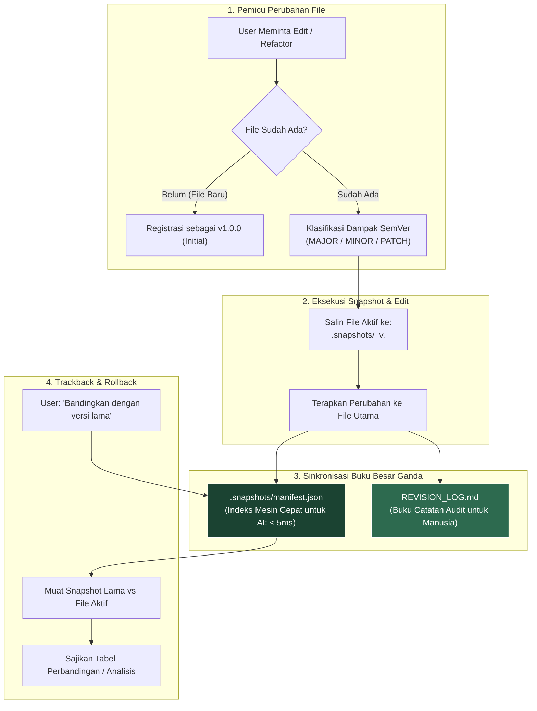

<div align="center">

# 🛡️ Agent-Checkpoint

**Pencadangan file pra-edit tanpa kehilangan data, klasifikasi SemVer, dan buku catatan audit ganda untuk AI coding & riset otonom.**

[](./LICENSE)
[]()
[]()
[]()

---

**Pilihan Bahasa:**  
[🇬🇧 English](./README.md) • [🇮🇩 Bahasa Indonesia (Aktif)](./README.id.md)

---

</div>

## ⚡ Masalah: AI Menimpa File Secara Destruktif

AI coding agent otonom (Cursor, Claude Code, Google Antigravity, Windsurf, GitHub Copilot, Aider) semakin mempercepat pengembangan software dan riset ilmiah. Namun, hampir semua AI memiliki perilaku bawaan yang berbahaya: **mereka menimpa file secara langsung tanpa menyimpan riwayat sebelumnya**.

* ❌ **Regresi Diam-diam:** AI merefaktor kode dan secara tidak sengaja menghilangkan penanganan kasus kritis (*edge cases*) atau formula penting.
* ❌ **Nol Jejak Audit:** Anda kembali ke proyek tanpa mengetahui *mengapa* perubahan logika atau parameter tertentu dilakukan oleh AI.
* ❌ **Halusinasi Permanen:** Kesalahan interpretasi perintah membuat AI menghapus draf naskah atau kode kerja berjam-jam.
* ❌ **Riwayat Git Kotor:** Developer terpaksa membuat puluhan *micro-commit* Git hanya agar punya jaring pengaman untuk *undo*.

---

## 💡 Solusi: Protokol Agent-Checkpoint

**Agent-Checkpoint** adalah protokol ultra-ringan tanpa dependensi (*zero-dependency*) yang dipasang dalam hitungan detik. Protokol ini memberlakukan aturan mutlak pada AI: **dilarang menyentuh file yang ada tanpa menyalin versi lamanya terlebih dahulu**, sekaligus mencatat jurnal audit yang menjelaskan *alasan* perubahan tersebut.

---

## 🌟 Keuntungan Utama

### 1. 🛡️ Keamanan Mutlak (Nol Data Hilang)
Sebelum mengedit file, AI secara otomatis menyalin versi utuh sebelumnya ke folder tersembunyi `.snapshots/`. Kode dan dokumen Anda tidak akan pernah tertimpa tanpa jejak.

### 2. 📝 Jurnal Audit Otomatis (Audit Trail)
AI secara otomatis memperbarui file `REVISION_LOG.md` yang mencatat **alasan teknis dan arsitektural** di balik setiap perubahan. Sangat berguna untuk:
* Ringkasan *code review* dan evaluasi tim.
* Menelusuri kembali apa yang diubah AI semalam tanpa harus menebak-nebak.
* Rekam jejak kepatuhan (*compliance*) dan transparansi proyek ilmiah.

### 3. 🎯 Tanpa Dependensi & 100% Privat
* **Tanpa instalasi:** Tidak butuh `npm`, `pip`, Docker, atau server latar belakang.
* **100% Lokal & Offline:** Semua snapshot dan log tersimpan di harddisk lokal Anda sendiri. Nol data dikirim ke luar.

### 4. 🔀 Pelacakan Mundur & Rollback Cepat
Anda dapat meminta AI kapan saja: *"Bandingkan `auth_service.py` dengan versi sebelum direfaktor"* atau *"Kembalikan `auth_service.py` ke versi `v1.0.0`"*. AI akan memuat snapshot lama dan menyajikan perbandingan atau pemulihan seketika.

---

## 🏗️ Arsitektur: Sistem Buku Besar Ganda (Dual-Ledger)



---

## 🔰 Panduan Pemula (Pemasangan 30 Detik)

Pemasangan tidak memerlukan konfigurasi rumit maupun perintah terminal. Cukup gunakan metode *drop-in file*.

### Cara 1: Menggunakan File Explorer (Paling Mudah)
1. Buka folder [`adapters/`](./adapters) di repositori ini.
2. Pilih 1 file yang sesuai dengan aplikasi AI Anda:
   * **Cursor IDE:** Salin file [`.cursorrules`](./adapters/.cursorrules)
   * **Claude Code:** Salin file [`CLAUDE.md`](./adapters/CLAUDE.md)
   * **Google Antigravity / Gemini CLI:** Salin aturan dari [`AGENTS.md`](./adapters/AGENTS.md)
   * **Windsurf (Cascade):** Salin file [`.windsurfrules`](./adapters/.windsurfrules)
   * **GitHub Copilot:** Salin file [`copilot-instructions.md`](./adapters/copilot-instructions.md) ke folder `.github/`
3. Tempel (*paste*) file tersebut ke folder root proyek Anda.
4. **Selesai!** AI di aplikasi Anda sudah otomatis terlindungi.

---

### Cara 2: Menggunakan Terminal (Perintah 1-Baris)
Jalankan perintah ini di dalam root proyek Anda:

* **Cursor IDE:**
  ```bash
  curl -o .cursorrules https://raw.githubusercontent.com/username/agent-checkpoint/main/adapters/.cursorrules
  ```
* **Claude Code:**
  ```bash
  curl -o CLAUDE.md https://raw.githubusercontent.com/username/agent-checkpoint/main/adapters/CLAUDE.md
  ```
* **Windsurf:**
  ```bash
  curl -o .windsurfrules https://raw.githubusercontent.com/username/agent-checkpoint/main/adapters/.windsurfrules
  ```

---

## 🎮 Penggunaan Sehari-hari (Zero Learning Curve)

Setelah adapter terpasang, **Anda tidak perlu menghafal perintah baru**. Berinteraksilah dengan AI seperti biasa:

### 1. Meminta AI Mengedit Kode
Beri prompt seperti biasa:
> *"Tolong refactor fungsi autentikasi login di auth_service.py agar mendukung JWT token refresh dan rate limiting."*

**Secara otomatis di balik layar, AI akan:**
1. Mencadangkan file lama Anda ke `.snapshots/auth_service_v1.0.0.py`.
2. Menerapkan perubahan pada `auth_service.py` (naik versi menjadi `v1.1.0`).
3. Mencatat alasan teknis ke `REVISION_LOG.md` dan `.snapshots/manifest.json`.

---

### 2. Memeriksa Perubahan (*Trackback*)
Lihat perbedaan tanpa perlu membuka git diff secara manual:
> *"Bandingkan auth_service.py dengan versi sebelum direvisi. Apa saja logic keamanan dan error handling yang berubah?"*

AI akan langsung membaca snapshot lama dan menyajikan perbandingan *Before vs After*.

---

### 3. Membatalkan Perubahan (*Rollback*)
Jika hasil kodingan AI tidak sesuai harapan:
> *"Batalkan perubahan pada auth_service.py dan kembalikan ke versi v1.0.0."*

AI akan mengembalikan file dari `.snapshots/` dengan aman.

---

## 📂 Struktur Folder Proyek

Setelah aktif, proyek Anda akan memiliki struktur rapi berikut:

```text
my-project/
├── .snapshots/                          # Folder snapshot riwayat (dikelola otomatis)
│   ├── manifest.json                    # Indeks cepat untuk AI (< 5ms)
│   ├── auth_service_v1.0.0.py           # Snapshot cadangan sebelum diedit
│   └── api_routes_v1.0.0.ts
├── REVISION_LOG.md                      # Log riwayat lengkap untuk dibaca manusia/tim
├── auth_service.py                      # File aktif versi terbaru (v1.1.0)
└── api_routes.ts                        # File aktif versi terbaru
```

---

## ⚠️ Batasan yang Diketahui (Known Limitations)

Demi transparansi rekayasa perangkat lunak, versi `v1.0` memiliki batasan berikut:

| Batasan | Konteks Teknis | Saran Mitigasi |
| :--- | :--- | :--- |
| **1. Kepatuhan Model Kecil** | Protokol berbasis instruksi sistem. Model tier-1 (Claude 3.5/3.7, GPT-4o, Gemini 2.0 Pro) memiliki kepatuhan **~100%**. Model kecil lokal (7B/8B) sesekali bisa lupa membuat snapshot jika sesi chat sangat panjang. | Gunakan model cerdas untuk tugas refactoring utama. |
| **2. Penumpukan Snapshot** | Jika file diedit ratusan kali, folder `.snapshots/` akan terus bertambah. Fitur pembersihan otomatis (*auto-pruning*) belum disertakan di v1.0. | File teks memakan storage sangat sedikit (~10 MB/bln), tetapi disarankan menghapus versi patch lama secara berkala. |
| **3. Operasi Delete / Rename** | Versi 1.0 berfokus pada edit isi (*modify*). Menghapus file lewat terminal (`rm`) belum dicegat secara otomatis. | Lakukan konfirmasi manual sebelum menyuruh AI menghapus file secara permanen. |
| **4. Refactoring Multi-File Sekaligus** | Mengubah 10 file dalam 1 prompt akan menghasilkan 10 entri log terpisah daripada 1 entri grup (*changeset*). | Lakukan refactor bertahap per modul. |

---

## 🛡️ Batasan Kapasitas Penyimpanan

| Kategori Berkas | Kebijakan Snapshot | Contoh Ekstensi |
| :--- | :--- | :--- |
| **Teks & Kode Sumber** | ✅ **Diarsipkan Otomatis** | Python (`.py`), TypeScript (`.ts`), Markdown (`.md`), LaTeX (`.tex`), Config (`.json`, `.yaml`) |
| **File Biner Berat** | 🚫 **Dikecualikan (Tidak Diarsip)** | Bobot Model ML (`.pt`, `.onnx`, `.bin`), Dataset Besar (`> 5MB`, `.parquet`, `.h5`) |
| **Folder Cache / Dependensi** | 🚫 **Dikecualikan (Aman)** | `node_modules/`, `venv/`, `__pycache__/`, `build/`, `.git/` |

**Estimasi Ruang Penyimpanan:**  
Untuk 500 kali modifikasi berkas dalam sebulan, konsumsi disk rata-rata hanya berkisar antara **7.5 MB hingga 15 MB**. Sangat kecil untuk kapasitas penyimpanan modern.

---

## 📄 Lisensi & Komunitas

Didistribusikan di bawah [Lisensi MIT](./LICENSE) — bebas digunakan untuk proyek pribadi, riset akademik, maupun komersial.

Kontribusi, *pull request*, dan saran fitur baru sangat kami sambut! ⭐ Silakan beri *Star* jika repositori ini membantu melindungi pekerjaan Anda.
