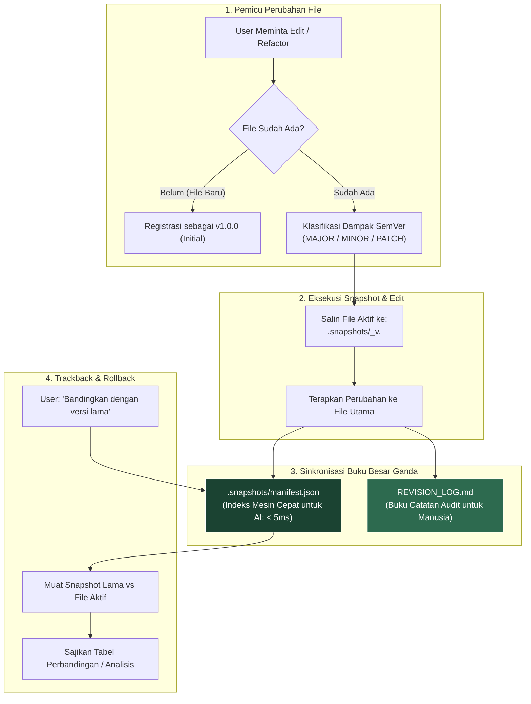
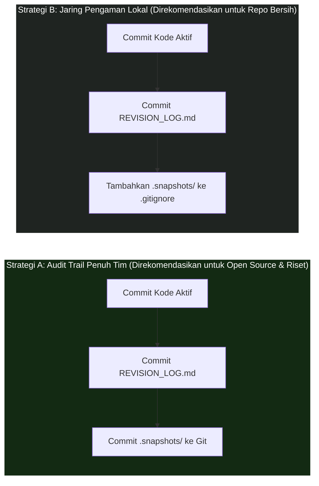

<div align="center">

# 🛡️ Agent-Checkpoint

**Pencadangan file pra-edit tanpa kehilangan data, klasifikasi SemVer, dan buku catatan audit ganda untuk AI coding & riset otonom.**

[](./LICENSE)
[]()
[]()
[]()

---

**Pilihan Bahasa:**  
[🇬🇧 English](./README.md) • [🇮🇩 Bahasa Indonesia (Aktif)](./README.id.md)

---

</div>

## ⚡ Masalah: AI Menimpa File Secara Destruktif

AI coding agent otonom (Cursor, Claude Code, Google Antigravity, Windsurf, GitHub Copilot, Aider) semakin mempercepat pengembangan software dan riset ilmiah. Namun, hampir semua AI memiliki perilaku bawaan yang berbahaya: **mereka menimpa file secara langsung tanpa menyimpan riwayat sebelumnya**.

* ❌ **Regresi Diam-diam:** AI merefaktor kode dan secara tidak sengaja menghilangkan penanganan kasus kritis (*edge cases*) atau formula penting.
* ❌ **Nol Jejak Audit:** Anda kembali ke proyek tanpa mengetahui *mengapa* perubahan logika atau parameter tertentu dilakukan oleh AI.
* ❌ **Halusinasi Permanen:** Kesalahan interpretasi perintah membuat AI menghapus draf naskah atau kode kerja berjam-jam.
* ❌ **Riwayat Git Kotor:** Developer terpaksa membuat puluhan *micro-commit* Git hanya agar punya jaring pengaman untuk *undo*.

---

## 💡 Solusi: Protokol Agent-Checkpoint

**Agent-Checkpoint** adalah protokol ultra-ringan tanpa dependensi (*zero-dependency*) yang dipasang dalam hitungan detik. Protokol ini memberlakukan aturan mutlak pada AI: **dilarang menyentuh file yang ada tanpa menyalin versi lamanya terlebih dahulu**, sekaligus mencatat jurnal audit yang menjelaskan *alasan* perubahan tersebut.

---

## 🌟 Keuntungan Utama

### 1. 🛡️ Keamanan Mutlak (Nol Data Hilang)
Sebelum mengedit file, AI secara otomatis menyalin versi utuh sebelumnya ke folder tersembunyi `.snapshots/`. Kode dan dokumen Anda tidak akan pernah tertimpa tanpa jejak.

### 2. 📝 Jurnal Audit Otomatis (Audit Trail)
AI secara otomatis memperbarui file `REVISION_LOG.md` yang mencatat **alasan teknis dan arsitektural** di balik setiap perubahan. Sangat berguna untuk:
* Ringkasan *code review* dan evaluasi tim.
* Menelusuri kembali apa yang diubah AI semalam tanpa harus menebak-nebak.
* Rekam jejak kepatuhan (*compliance*) dan transparansi proyek ilmiah.

### 3. 🎯 Tanpa Dependensi & 100% Privat
* **Tanpa instalasi:** Tidak butuh `npm`, `pip`, Docker, atau server latar belakang.
* **100% Lokal & Offline:** Semua snapshot dan log tersimpan di harddisk lokal Anda sendiri. Nol data dikirim ke luar.

### 4. 🔀 Pelacakan Mundur & Rollback Cepat
Anda dapat meminta AI kapan saja: *"Bandingkan `auth_service.py` dengan versi sebelum direfaktor"* atau *"Kembalikan `auth_service.py` ke versi `v1.0.0`"*. AI akan memuat snapshot lama dan menyajikan perbandingan atau pemulihan seketika.

---

## 🏗️ Arsitektur: Sistem Buku Besar Ganda (Dual-Ledger)



---

## 🔰 Panduan Pemula (Pemasangan 30 Detik)

Pemasangan tidak memerlukan konfigurasi rumit maupun perintah terminal. Cukup gunakan metode *drop-in file*.

### Cara 1: Menggunakan File Explorer (Paling Mudah)
1. Buka folder [`adapters/`](./adapters) di repositori ini.
2. Pilih 1 file yang sesuai dengan aplikasi AI Anda:
   * **Cursor IDE:** Salin [`.cursorrules`](./adapters/.cursorrules) ke root proyek, atau salin [`agent-checkpoint.mdc`](./adapters/agent-checkpoint.mdc) ke dalam `.cursor/rules/` (Cursor 0.40+)
   * **Claude Code:** Salin file [`CLAUDE.md`](./adapters/CLAUDE.md)
   * **Google Antigravity / Gemini CLI:**
     - **Tingkat Proyek (Project Scope):** Salin [`adapters/AGENTS.md`](./adapters/AGENTS.md) ke root proyek Anda.
     - **Tingkat Global PC (Direkomendasikan):** Tambahkan isi [`adapters/AGENTS.md`](./adapters/AGENTS.md) ke `~/.gemini/AGENTS.md` (otomatis melindungi semua proyek di laptop Anda!).
     - **Tingkat Native Skill:** Salin [`SKILL.md`](./SKILL.md) ke folder skill Antigravity Anda (`.agents/skills/agent-checkpoint/SKILL.md` atau `~/.gemini/config/plugins/.../skills/agent-checkpoint/`).
   * **Windsurf (Cascade):** Salin file [`.windsurfrules`](./adapters/.windsurfrules)
   * **GitHub Copilot:** Salin file [`copilot-instructions.md`](./adapters/copilot-instructions.md) ke folder `.github/`
3. Tempel (*paste*) file tersebut ke folder root proyek Anda.
4. **Selesai!** AI di aplikasi Anda sudah otomatis terlindungi.

---

### Cara 2: Menggunakan Terminal (Perintah 1-Baris)
Jalankan perintah ini di dalam root proyek Anda:

* **Cursor IDE:**
  ```bash
  # Mode Classic .cursorrules:
  curl -o .cursorrules https://raw.githubusercontent.com/ainullm/agent-checkpoint/main/adapters/.cursorrules

  # Mode Modern Cursor Rules (.cursor/rules/*.mdc):
  mkdir -p .cursor/rules && curl -o .cursor/rules/agent-checkpoint.mdc https://raw.githubusercontent.com/ainullm/agent-checkpoint/main/adapters/agent-checkpoint.mdc
  ```
* **Claude Code:**
  ```bash
  curl -o CLAUDE.md https://raw.githubusercontent.com/ainullm/agent-checkpoint/main/adapters/CLAUDE.md
  ```
* **Google Antigravity / Gemini CLI:**
  ```bash
  # Khusus proyek aktif:
  curl -o AGENTS.md https://raw.githubusercontent.com/ainullm/agent-checkpoint/main/adapters/AGENTS.md

  # Atau Global untuk seluruh proyek di komputer Anda:
  # Linux/macOS:
  curl -s https://raw.githubusercontent.com/ainullm/agent-checkpoint/main/adapters/AGENTS.md >> ~/.gemini/AGENTS.md
  # Windows PowerShell:
  Add-Content -Path "$HOME\.gemini\AGENTS.md" -Value (Invoke-RestMethod "https://raw.githubusercontent.com/ainullm/agent-checkpoint/main/adapters/AGENTS.md")
  ```
* **Windsurf:**
  ```bash
  curl -o .windsurfrules https://raw.githubusercontent.com/ainullm/agent-checkpoint/main/adapters/.windsurfrules
  ```

---

## 🎮 Panduan Penggunaan Lengkap & Skenario Nyata

Setelah file adapter terpasang, **tidak ada perintah CLI atau sintaks khusus yang perlu Anda hafalkan**. Anda dapat berinteraksi dengan AI secara natural seperti biasa. Berikut adalah 4 alur kerja (*workflows*) standar yang paling sering digunakan:

---

### Alur Kerja 1: Penambahan Fitur & Refaktorisasi Sehari-hari

**Perintah (Prompt) yang Anda Berikan ke AI:**
> *"Tolong refactor fungsi autentikasi di `auth_service.py` agar mendukung JWT refresh token, tambahkan pembatasan frekuensi (rate limiting) dengan Redis, dan perbaiki penanganan error."*

**Yang Dilakukan AI Secara Otomatis di Balik Layar:**
1. **Memeriksa Status Berkas:** Mendeteksi bahwa `auth_service.py` sudah ada pada versi `v1.0.0`.
2. **Membuat Snapshot Pra-Edit:** Menyalin `auth_service.py` $\to$ `.snapshots/auth_service_v1.0.0.py`.
3. **Mengklasifikasikan Dampak SemVer:** Mengevaluasi perubahan. Karena menambahkan fitur baru tanpa merusak antarmuka lama, AI mengkategorikannya sebagai `MINOR` ($\to$ `v1.1.0`).
4. **Menerapkan Modifikasi:** Menimpa `auth_service.py` dengan kode baru yang diminta.
5. **Menyelaraskan Buku Besar Ganda (*Dual-Ledger*):**
   * Menambahkan indeks mesin ke `.snapshots/manifest.json`.
   * Menambahkan catatan teknis ke `REVISION_LOG.md` lengkap dengan rentang baris dan rasional arsitekturnya.

---

### Alur Kerja 2: Pemulihan Darurat / Rollback (Menangani Halusinasi AI)

Jika AI berhalusinasi, menghapus logika bisnis yang penting, atau menimbulkan error yang merusak aplikasi:

**Perintah (Prompt) yang Anda Berikan ke AI:**
> *"Perubahan pada `auth_service.py` menyebabkan unit test gagal. Tolong batalkan perubahan dan kembalikan `auth_service.py` ke versi `v1.0.0`."*

**Yang Dilakukan AI:**
1. Mencari versi `v1.0.0` di dalam `.snapshots/manifest.json`.
2. Menyalin kembali `.snapshots/auth_service_v1.0.0.py` menimpa file aktif `auth_service.py`.
3. Mencatat aksi rollback di `REVISION_LOG.md` (misal: `PATCH: Rolled back auth_service.py dari v1.1.0 ke v1.0.0 karena kegagalan pengujian`).
4. Kode Anda seketika kembali ke kondisi stabil tanpa Anda perlu panik mencari baris kode yang hilang.

---

### Alur Kerja 3: Pelacakan Riwayat Mendalam (*Trackback*) & Analisis Diff

Ketika Anda kembali ke komputer setelah AI selesai melakukan banyak revisi berturut-turut:

**Perintah (Prompt) yang Anda Berikan ke AI:**
> *"Trackback: Bandingkan `data_pipeline.py` dengan versi sebelum optimasi vektor. Jelaskan fungsi mana saja dan kompleksitas algoritma apa yang berubah?"*

**Yang Dilakukan AI:**
1. Membaca snapshot lama `.snapshots/data_pipeline_v1.0.0.py` dan file aktif `data_pipeline.py`.
2. Membaca `REVISION_LOG.md` untuk memahami konteks perubahan.
3. Menyajikan laporan komparasi *Before vs After* yang jelas, menyoroti fungsi yang berubah tanpa Anda harus menjalankan perintah `git diff` yang rumit.

---

### Alur Kerja 4: Perubahan Multi-File Sekaligus (Cursor Composer & Agent Mode)

Saat menggunakan fitur Cursor Composer atau Claude Code untuk proyek multi-file:
> *"Buat alur checkout pembayaran baru: perbarui `routes.ts`, `stripe_client.py`, dan `database.sql`."*

Protokol ini berjalan secara berurutan dan terisolasi untuk setiap target file:
* `.snapshots/routes_v1.0.0.ts`
* `.snapshots/stripe_client_v1.0.0.py`
* `.snapshots/database_v1.0.0.sql`

Masing-masing file mendapatkan cadangan tersendiri dan tercatat rapi di `manifest.json` serta `REVISION_LOG.md`.

---

## 🤝 Strategi Integrasi dengan Git: Cara Mengelola Folder `.snapshots/`

Agent-Checkpoint dirancang untuk melengkapi Git, bukan menggantikannya. Anda dapat memilih salah satu dari dua strategi berikut sesuai kebutuhan tim:



* **Strategi A (Audit Trail Lengkap Tim):** Masukkan `.snapshots/` ke dalam commit Git. Rekan kerja yang melakukan *pull* dapat melihat kode lama yang diubah AI dan meninjau log revisi langsung saat proses *Code Review / Pull Request*.
* **Strategi B (Pengaman Lokal Mandiri):** Tambahkan `.snapshots/` ke dalam file `.gitignore`, namun tetap sertakan `REVISION_LOG.md` di Git. Anda tetap mendapatkan proteksi rollback 100% di komputer lokal, sementara ukuran repositori Git di cloud tetap sangat ramping.

---

## 📂 Struktur Folder Proyek

Setelah aktif, proyek Anda akan memiliki struktur rapi berikut:

```text
my-project/
├── .snapshots/                          # Folder snapshot riwayat (dikelola otomatis)
│   ├── manifest.json                    # Indeks cepat untuk AI (< 5ms)
│   ├── auth_service_v1.0.0.py           # Snapshot cadangan sebelum diedit
│   └── api_routes_v1.0.0.ts
├── REVISION_LOG.md                      # Log riwayat lengkap untuk dibaca manusia/tim
├── auth_service.py                      # File aktif versi terbaru (v1.1.0)
└── api_routes.ts                        # File aktif versi terbaru
```

---

## 💾 Analisis Konsumsi Penyimpanan & Skenario Penggunaan Nyata

Kekhawatiran umum saat menggunakan sistem snapshot adalah: *"Apakah ini akan membuat harddisk saya penuh seiring waktu?"*  
Jawabannya adalah: **Sama sekali tidak. File teks kode berukuran sangat kecil, dan batasan cerdas menjamin nol pembengkakan data.**

### 📊 Simulasi Skenario Penggunaan Nyata & Hitungan Matematis

Tabel di bawah mengasumsikan ukuran rata-rata satu file kode sumber adalah **15 KB** (setara dengan 300–600 baris kode Python, TypeScript, atau Go):

| Profil Pengguna | Frekuensi Edit AI Harian | Rata-rata Ukuran File | Penggunaan Disk / Bulan | Penggunaan Disk / Tahun | % dari SSD 512 GB |
| :--- | :---: | :---: | :---: | :---: | :---: |
| 🧑‍💻 **Hobi / Mahasiswa**<br>*(Proyek santai, tugas kuliah, sesekali eksperimen)* | ~2 edit/hari<br>*(10/minggu)* | 15 KB | **~0.9 MB** | **~10.8 MB** | `0.002%` |
| 🚀 **Software Engineer Penuh Waktu**<br>*(Membangun fitur setiap hari, refaktorisasi aktif)* | ~30 edit/hari | 15 KB | **~13.5 MB** | **~162 MB** | `0.031%` |
| ⚡ **Power User AI Pair Programming**<br>*(Pengguna berat Cursor Composer, 10+ sesi prompt/hari)* | ~100 edit/hari | 15 KB | **~45.0 MB** | **~540 MB** | `0.105%` |
| 🤖 **Bot Agen Otonom Berkelanjutan**<br>*(Loop otomatisasi penulisan kode dan testing non-stop)* | ~500 edit/hari | 15 KB | **~225.0 MB** | **~2.7 GB** | `0.527%` |

> 💡 **Kesimpulan:** Bahkan seorang software engineer aktif yang melakukan 30 kali revisi kode per hari hanya menghabiskan **kurang dari 200 MB dalam satu tahun penuh** — lebih kecil dari satu aplikasi desktop atau folder `node_modules` sederhana.

---

### 🛡️ Mengapa Ruang Penyimpanan Tidak Akan Pernah Penuh? (3 Pilar Keamanan)

1. **Jejak Teks yang Mikroskopis:** Berkas teks sangat ringkas. 100 snapshot file 10 KB hanya memakan 1 MB.
2. **📏 Batas Cerdas 1 MB untuk Data Tabular:** File data pengujian (`.csv`, `.jsonl`, `.tsv`) $\le 1\text{ MB}$ akan di-snapshot. Dataset $> 1\text{ MB}$ secara ketat dilewati dari penyalinan fisik dan hanya dicatat metadatanya saja.
3. **🚫 Pengecualian Mutlak File Biner Berat:** Bobot model machine learning (`.pt`, `.onnx`, `.safetensors`), arsip biner (`.zip`, `.exe`), dan folder dependensi (`node_modules/`, `venv/`, `__pycache__/`) **sama sekali tidak pernah diarsip**.

---

### 🧹 Panduan Pembersihan & Retensi (Membebaskan Ruang Kapan Saja)

Karena folder `.snapshots/` hanya berisi arsip riwayat dan bukan kode yang sedang berjalan (*runtime*), **menghapus atau membersihkan isi snapshot 100% aman dan tidak akan merusak proyek Anda**.

#### 1. Menghapus Snapshot yang Berumur Lebih dari 30 Hari
* **PowerShell (Windows):**
  ```powershell
  Get-ChildItem -Path .snapshots -File | Where-Object { $_.LastWriteTime -lt (Get-Date).AddDays(-30) -and $_.Name -ne "manifest.json" } | Remove-Item
  ```
* **Bash / Zsh (Linux & macOS):**
  ```bash
  find .snapshots/ -type f ! -name "manifest.json" -mtime +30 -delete
  ```

#### 2. Menyimpan Hanya 5 Versi Terakhir per File
* **Bash / Zsh:**
  ```bash
  # Menghapus file snapshot lama dan tetap mempertahankan manifest.json
  ls -t .snapshots/*_*.* 2>/dev/null | tail -n +15 | xargs -r rm --
  ```

#### 3. Reset Total (Membersihkan Bersih)
Jika sebuah proyek sudah selesai dan Anda ingin mengosongkan folder snapshot:
```bash
# Menghapus seluruh snapshot dan mereset indeks mesin
rm -rf .snapshots && mkdir .snapshots && echo "[]" > .snapshots/manifest.json
```

---

## 🌐 Dukungan Berkas Universal (Mendukung 100+ Format)

Agent-Checkpoint sepenuhnya independen terhadap bahasa dan format berkas:

* **Bahasa Pemrograman & Sistem:** Python (`.py`), TypeScript (`.ts`, `.tsx`), JavaScript (`.js`, `.jsx`), Go (`.go`), Rust (`.rs`), C/C++ (`.c`, `.cpp`, `.h`, `.hpp`), C# (`.cs`), Java (`.java`), PHP (`.php`), Ruby (`.rb`), Swift (`.swift`), Kotlin (`.kt`), Dart (`.dart`), Scala (`.scala`), Shell (`.sh`, `.bash`, `.zsh`), PowerShell (`.ps1`, `.bat`), Lua (`.lua`), R (`.r`), Julia (`.jl`).
* **Web & Antarmuka Frontend:** HTML (`.html`), CSS (`.css`), SCSS/SASS (`.scss`), Vue (`.vue`), Svelte (`.svelte`), XML (`.xml`), SVG (`.svg`).
* **Data Science & Riset Modern:** Jupyter Notebooks (`.ipynb`), Typst (`.typ`), LaTeX (`.tex`, `.bib`, `.sty`), Markdown (`.md`, `.mdx`), RestructuredText (`.rst`), AsciiDoc (`.adoc`), Plain text (`.txt`).
* **Diagrams & Visual Berbasis Kode:** Mermaid (`.mmd`, `.mermaid`), PlantUML (`.puml`), Graphviz (`.dot`), Draw.io XML (`.drawio`), Excalidraw JSON (`.excalidraw`).
* **Skema API, Kontrak & Protokol:** Protobuf (`.proto`), GraphQL (`.graphql`, `.gql`), Prisma (`.prisma`), OpenAPI / Swagger (`.yaml`, `.json`), Apache Thrift (`.thrift`), FlatBuffers (`.fbs`).
* **Game Development & Shaders:** GLSL (`.glsl`, `.frag`, `.vert`), HLSL (`.hlsl`), WGSL (`.wgsl`), Godot GDScript (`.gd`, `.tscn`), Unreal Engine text configs (`.ini`).
* **Hardware & Sistem Tertanam (Embedded):** Verilog (`.v`, `.vh`), SystemVerilog (`.sv`), VHDL (`.vhd`), Assembly (`.asm`, `.s`), Arduino (`.ino`), CMake (`CMakeLists.txt`, `.cmake`).
* **DevOps, IaC & Kebijakan Keamanan:** Open Policy Agent Rego (`.rego`), CUE (`.cue`), Terraform (`.tf`), Kubernetes manifests, Dockerfile, Makefile, JSON, YAML, TOML, SQL (`.sql`).

---

## ⚠️ Batasan yang Diketahui (Known Boundaries v1.0)

| Batasan | Konteks Teknis | Saran Mitigasi |
| :--- | :--- | :--- |
| **1. Kepatuhan Model Kecil** | Protokol berbasis instruksi sistem. Model tier-1 (Claude 3.5/3.7, GPT-4o, Gemini 2.0 Pro) memiliki kepatuhan **~100%**. Model kecil lokal (7B/8B) sesekali bisa lupa membuat snapshot jika sesi chat sangat panjang. | Gunakan model cerdas untuk tugas refactoring utama. |
| **2. Penumpukan Snapshot** | Jika file diedit ratusan kali, folder `.snapshots/` akan terus bertambah. Fitur pembersihan otomatis (*auto-pruning*) belum disertakan di v1.0. | File teks memakan storage sangat sedikit (~10 MB/bln), tetapi disarankan membersihkan versi lama secara berkala menggunakan perintah di atas. |
| **3. Operasi Delete / Rename** | Versi 1.0 berfokus pada edit isi (*modify*). Menghapus file lewat terminal (`rm`) belum dicegat secara otomatis. | Lakukan konfirmasi manual sebelum menyuruh AI menghapus file secara permanen. |
| **4. Refactoring Multi-File Sekaligus** | Mengubah 10 file dalam 1 prompt akan menghasilkan 10 entri log terpisah daripada 1 entri grup (*changeset*). | Lakukan refactor bertahap per modul. |

---

## 📄 Lisensi & Komunitas

Didistribusikan di bawah [Lisensi MIT](./LICENSE) — bebas digunakan untuk proyek pribadi, riset akademik, maupun komersial.

Kontribusi, *pull request*, dan saran fitur baru sangat kami sambut! ⭐ Silakan beri *Star* jika repositori ini membantu melindungi pekerjaan Anda.
