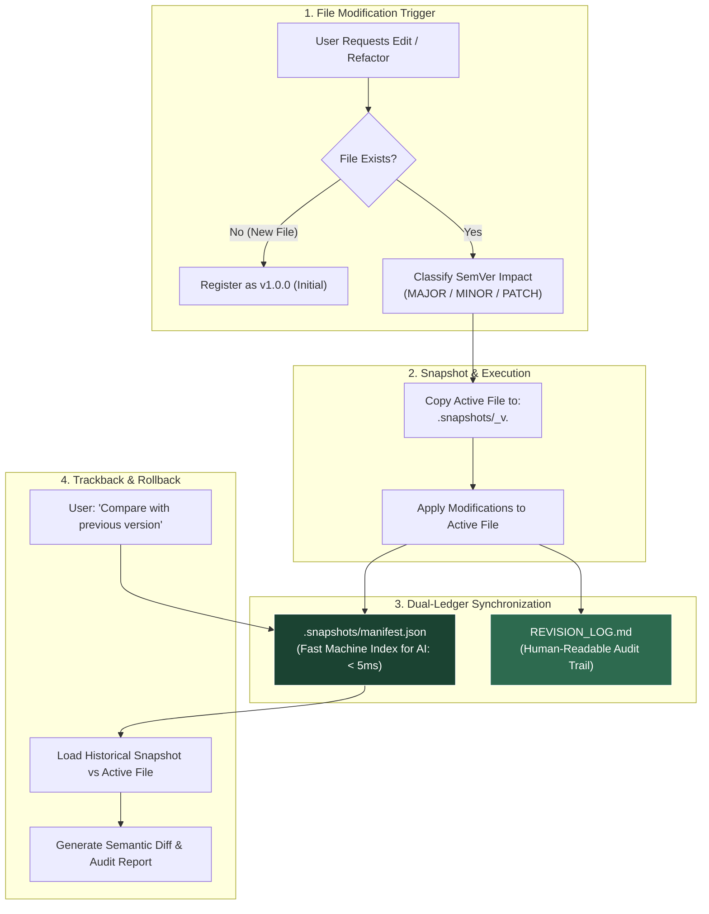

<div align="center">

# 🛡️ Agent-Checkpoint

**Zero-data-loss file snapshotting, SemVer classification, and dual-ledger audit trail for autonomous AI coding & research agents.**

[](./LICENSE)
[]()
[]()
[]()

---

**Languages:**  
[English (Current)](./README.md) • [🇮🇩 Bahasa Indonesia](./README.id.md)

---

</div>

## ⚡ The Problem: Destructive In-Place AI Overwrites

Autonomous AI coding agents (Cursor, Claude Code, Google Antigravity, Windsurf, GitHub Copilot, Aider) are accelerating software development and scientific research. However, almost every agent shares a dangerous default behavior: **they overwrite files in-place without preserving history**.

* ❌ **Silent Regression:** An AI agent refactors a module and inadvertently drops a critical edge case, business constraint, or formula.
* ❌ **Zero Paper Trail:** You return to your workspace without knowing *why* specific architectural decisions or parameter changes were made.
* ❌ **Irreversible Hallucination:** A misunderstood prompt causes the agent to wipe out hours of draft writing, LaTeX formulas, or working code.
* ❌ **Git Micro-Commit Noise:** Developers feel forced to make dozens of messy Git commits just to maintain an undo safety net.

---

## 💡 The Solution: The Agent-Checkpoint Protocol

**Agent-Checkpoint** is an ultra-lightweight, zero-dependency protocol that installs in seconds. It enforces a simple, unbreakable rule on AI agents: **never touch an existing file without archiving its previous state first**, while automatically maintaining an audit ledger explaining *why* the change occurred.

---

## 🌟 Key Benefits

### 1. 🛡️ Absolute Safety (Zero Data Loss)
Before modifying any file, the agent copies its exact prior state into `.snapshots/`. Your working code and drafts are never permanently destroyed or overwritten.

### 2. 📝 Automatic Audit Trail (Living Engineering Journal)
The agent automatically maintains `REVISION_LOG.md`, detailing the **technical and architectural rationale** behind every modification. Ideal for:
* Team code reviews and pull request summaries.
* Post-mortem debugging without guessing what the AI changed overnight.
* Academic and enterprise compliance audit trails.

### 3. 🎯 Zero Dependency & 100% Private
* **No package managers:** Requires no `npm`, `pip`, Docker, or background daemon.
* **100% Local & Offline:** All snapshots and logs remain strictly on your local disk. Zero telemetry or external network calls.

### 4. 🔀 Deep Trackback & Time-Travel
Ask your AI at any time: *"Compare `auth_service.py` with the version before the refactor"* or *"Revert `auth_service.py` back to `v1.0.0`"*. The agent retrieves the snapshot and performs semantic diffs or restorations instantly.

---

## 🏗️ Architecture: Dual-Ledger System



---

## 🔰 Beginner's Quickstart (30-Second Setup)

Installation requires **zero configuration and no command-line tools**. It follows a simple drop-in pattern.

### Option 1: File Explorer / Drag-and-Drop (Easiest)
1. Open the [`adapters/`](./adapters) folder in this repository.
2. Select the single file matching your AI tool:
   * **Cursor IDE:** Copy [`.cursorrules`](./adapters/.cursorrules)
   * **Claude Code:** Copy [`CLAUDE.md`](./adapters/CLAUDE.md)
   * **Google Antigravity / Gemini CLI:** Copy the rules from [`AGENTS.md`](./adapters/AGENTS.md)
   * **Windsurf (Cascade):** Copy [`.windsurfrules`](./adapters/.windsurfrules)
   * **GitHub Copilot:** Copy [`copilot-instructions.md`](./adapters/copilot-instructions.md) into your `.github/` folder
3. Paste the file into your project's root folder.
4. **Done!** Your AI is now governed by the Agent-Checkpoint protocol.

---

### Option 2: 1-Line Terminal Download (`curl`)
Run the command matching your editor inside your project root:

* **Cursor IDE:**
  ```bash
  curl -o .cursorrules https://raw.githubusercontent.com/username/agent-checkpoint/main/adapters/.cursorrules
  ```
* **Claude Code:**
  ```bash
  curl -o CLAUDE.md https://raw.githubusercontent.com/username/agent-checkpoint/main/adapters/CLAUDE.md
  ```
* **Windsurf:**
  ```bash
  curl -o .windsurfrules https://raw.githubusercontent.com/username/agent-checkpoint/main/adapters/.windsurfrules
  ```

---

## 🎮 Day-to-Day Workflow (Zero Learning Curve)

Once the adapter is placed, **you do not need to memorize new commands**. Continue interacting with your AI agent normally:

### 1. Requesting Edits / Refactoring
Issue your standard instructions:
> *"Please refactor the login authentication in `auth_service.py` to support JWT refresh tokens and rate limiting."*

**Automatically in the background, your AI will:**
1. Backup your existing file to `.snapshots/auth_service_v1.0.0.py`.
2. Apply the requested changes to `auth_service.py` (bumping to `v1.1.0`).
3. Append technical rationale to `REVISION_LOG.md` and `.snapshots/manifest.json`.

---

### 2. Inspecting Differences (*Trackback*)
Inspect what was changed without manual diffing:
> *"Compare `auth_service.py` with the version before the latest refactor. What security logic and error handling changed?"*

The agent reads the snapshot and provides a side-by-side Before vs After analysis.

---

### 3. Reverting Changes (*Rollback*)
If an AI modification introduced issues:
> *"Revert `auth_service.py` back to `v1.0.0`."*

The agent safely restores the file from `.snapshots/` without corrupting your workspace history.

---

## 📂 Resulting Directory Layout

Once active, your project maintains an organized, self-documenting structure:

```text
my-project/
├── .snapshots/                          # Historical snapshots (auto-managed)
│   ├── manifest.json                    # Machine-readable registry (< 5ms read)
│   ├── auth_service_v1.0.0.py           # Preserved pre-edit snapshot
│   └── api_routes_v1.0.0.ts
├── REVISION_LOG.md                      # Human-readable engineering audit trail
├── auth_service.py                      # Active working file (v1.1.0)
└── api_routes.ts                        # Active working file
```

---

## ⚠️ Known Limitations

In the interest of software engineering transparency, version `v1.0` has the following known boundaries:

| Limitation | Technical Context | Recommended Mitigation |
| :--- | :--- | :--- |
| **1. Small Model Compliance** | The protocol relies on system prompt instructions. Tier-1 models (Claude 3.5/3.7, GPT-4o, Gemini 2.0 Pro) exhibit **~100% compliance**. Smaller local models (7B/8B) may occasionally omit a snapshot during very long conversation windows. | Use capable reasoning models for major refactoring tasks. |
| **2. Snapshot Sprawl** | If a single file is modified hundreds of times, `.snapshots/` accumulates individual files. Auto-pruning is not yet included in v1.0. | Plain-text files consume minimal storage (~10 MB/month), but periodic manual pruning of old patch versions is recommended. |
| **3. File Deletion & Renaming** | Version 1.0 targets file content edits (`modify`). Deleting a file via terminal (`rm`) is not yet intercepted automatically. | Confirm manual verification before instructing agents to execute permanent file deletions. |
| **4. Multi-File Batch Edits** | Modifying 10 files in a single prompt creates 10 individual log entries rather than a single unified changeset. | Refactor modules in focused, logical increments. |

---

## 🛡️ Storage & Safety Guardrails

| Category | Policy | Examples |
| :--- | :--- | :--- |
| **Plain Text & Source Code** | ✅ **Auto-Snapshotted** | Python (`.py`), TypeScript (`.ts`), Markdown (`.md`), LaTeX (`.tex`), Configs (`.json`, `.yaml`) |
| **Heavy Binaries** | 🚫 **Excluded (Never Snapshotted)** | Model weights (`.pt`, `.onnx`, `.bin`), Large datasets (`> 5MB`, `.parquet`, `.h5`) |
| **Build & Cache Directories** | 🚫 **Excluded (Safe)** | `node_modules/`, `venv/`, `__pycache__/`, `build/`, `.git/` |

**Storage Footprint:**  
For 500 active file edits in a month, total storage overhead typically ranges between **7.5 MB and 15 MB**. Negligible on modern drives.

---

## 📄 License & Community

Distributed under the [MIT License](./LICENSE) — free for personal, academic, and commercial use.

Contributions, pull requests, and feedback are welcome! ⭐ Leave a star if this protocol helps safeguard your workflow.
