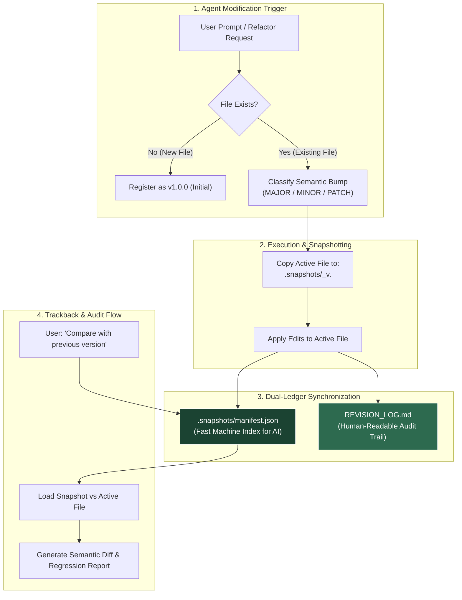

# 🛡️ Agent-Checkpoint

> **Zero-data-loss file snapshotting, SemVer classification, and dual-ledger audit trail for autonomous AI coding & research agents.**

[](./LICENSE)
[]()
[]()
[]()

---

## ⚡ The Problem: The Destructive AI Overwrite

Autonomous AI agents (Cursor, Claude Code, Antigravity, Windsurf, Aider) are transforming development and research. However, they share a critical flaw: **they edit files in-place**.

* ❌ **Silent Regression:** An AI agent refactors a module and inadvertently removes an essential edge case or formula.
* ❌ **Zero Paper Trail:** You wake up to modified code without knowing *why* specific architectural decisions or parameter changes were made.
* ❌ **Irreversible Hallucination:** A misunderstood prompt causes the agent to wipe out hours of manuscript drafting or mathematical derivation.
* ❌ **VCS Noise:** Polluting your Git branch with dozens of intermediate "try-and-error" micro-commits just to feel safe.

---

## 💡 The Solution: Agent-Checkpoint Protocol

**Agent-Checkpoint** is a lightweight, zero-dependency protocol that enforces strict versioning and automatic archiving before any AI agent modifies your files.

### Key Pillars:
1. **Pre-Edit Archiving (Zero Data Loss):** Before modifying any existing file, the agent automatically snapshots its exact prior state to `.snapshots/<filename>_v<OLD_VERSION>.<ext>`.
2. **Semantic Impact Classification:** Every change is triaged using Semantic Versioning principles:
   - `MAJOR`: Paradigm shift, breaking API contract, structural rewrite.
   - `MINOR`: New feature, new section, added baseline, experimental extension.
   - `PATCH`: Bug fix, parameter tuning, typo, editorial cleanup.
3. **Dual-Ledger Architecture:**
   - **Machine Index (`.snapshots/manifest.json`):** Ultra-compact JSON array parsed in `< 5ms`, preventing context window bloat.
   - **Human Audit Trail (`REVISION_LOG.md`):** Rich Markdown narrative detailing the *scientific and engineering rationale* behind every change.
4. **Deep Trackback & Time-Travel:** Inspect diffs, compare invariants, and rollback to historical states with zero guesswork.

---

## 🏗️ Architecture



---

## 📂 Directory Layout

Once enabled, your project directory maintains a clean, self-documenting structure:

```text
my-project/
├── .snapshots/                          # Archived states (isolated & lightweight)
│   ├── manifest.json                    # Machine-readable registry (< 5ms read)
│   ├── data_pipeline_v1.0.0.py          # Exact state before v1.1.0 update
│   └── model_v1.0.0.py
├── REVISION_LOG.md                      # Human-readable audit log
├── data_pipeline.py                     # Current active file (v1.1.0)
└── model.py                             # Current active file
```

---

## 🚀 Quick Start (Works with ANY Agent)

Agent-Checkpoint requires **no npm, no pip, and no background daemon**. Simply copy the adapter rule into your favorite AI tool:

### 1. Google Antigravity / Gemini CLI
Add the contents of [`adapters/AGENTS.md`](./adapters/AGENTS.md) to your workspace `AGENTS.md` or global `~/.gemini/AGENTS.md`:
```markdown
## 4. RESEARCH ARTIFACT VERSIONING & AUDIT TRAIL PROTOCOL
Before modifying or refactoring existing files in any project/research folder:
- Always adhere to the `agent-checkpoint` protocol.
- Pre-Edit Snapshot: Copy prior state to `.snapshots/<filename>_v<OLD_VERSION>.<ext>`.
- Impact Classification: Classify change into MAJOR, MINOR, or PATCH.
- Dual-Ledger Logging: Synchronize `.snapshots/manifest.json` and `REVISION_LOG.md`.
```

### 2. Anthropic Claude Code
Copy [`adapters/CLAUDE.md`](./adapters/CLAUDE.md) directly to the root of your project:
```bash
cp adapters/CLAUDE.md ./CLAUDE.md
```

### 3. Cursor IDE
Copy [`adapters/.cursorrules`](./adapters/.cursorrules) to your workspace root:
```bash
cp adapters/.cursorrules ./.cursorrules
```

### 4. Windsurf (Cascade)
Copy [`adapters/.windsurfrules`](./adapters/.windsurfrules) to your workspace root:
```bash
cp adapters/.windsurfrules ./.windsurfrules
```

### 5. GitHub Copilot Workspace
Copy [`adapters/copilot-instructions.md`](./adapters/copilot-instructions.md) to `.github/copilot-instructions.md`.

---

## 📖 Dual-Ledger Specification

### 1. Machine Index: `.snapshots/manifest.json`
Designed for instant AI parsing without polluting token context:
```json
[
  {
    "version": "1.1.0",
    "file": "data_pipeline.py",
    "snapshot": ".snapshots/data_pipeline_v1.0.0.py",
    "type": "MINOR",
    "timestamp": "2026-10-06T11:30:00Z",
    "rationale": "Add z-score feature scaling to prevent gradient saturation in downstream models",
    "changes": [
      "Added typing annotations (Tuple[pd.DataFrame, StandardScaler])",
      "Integrated sklearn StandardScaler for numeric columns",
      "Returned fitted scaler object for inference reproducibility"
    ]
  }
]
```

### 2. Human Audit Trail: `REVISION_LOG.md`
Designed for peer review, thesis defense, and team transparency:
```markdown
## [v1.1.0] - 2026-10-06 11:30:00 UTC
- **Target File:** `data_pipeline.py`
- **Change Type:** MINOR
- **Archived Snapshot:** `.snapshots/data_pipeline_v1.0.0.py`
- **Rationale:** Add z-score feature scaling to prevent gradient saturation in downstream models.
- **Key Changes Applied:**
  - Added strict typing annotations (`Tuple[pd.DataFrame, StandardScaler]`).
  - Integrated `sklearn.preprocessing.StandardScaler` over numeric features.
  - Returned fitted scaler alongside cleaned DataFrame for deployment pipeline reusability.
---
```

---

## 🛡️ Safety Guardrails & Disk Budget

| Category | Policy | Examples |
| :--- | :--- | :--- |
| **Tracked Artifacts** | ✅ Snapshot Enabled | Python (`.py`), TypeScript (`.ts`), Markdown (`.md`), LaTeX (`.tex`), Configs (`.json`, `.yaml`) |
| **Heavy Binaries** | 🚫 Excluded (Never Snapshot) | Model weights (`.pt`, `.onnx`, `.bin`), Datasets (`> 5MB`, `.parquet`, `.h5`) |
| **Build & Cache Dirs** | 🚫 Excluded (Never Snapshot) | `node_modules/`, `venv/`, `__pycache__/`, `dist/`, `build/`, `.git/` |

### Storage Footprint Estimate:
* Rata-rata file kode/teks: `10 KB - 50 KB`.
* 500 revisi aktif dalam sebulan: `~7.5 MB - 15 MB`.
* **Dampak storage hampir 0%** pada disk modern.

---

## 🔍 How to Use Trackback & Rollback

Once an agent is operating under the Agent-Checkpoint protocol, you can use natural language prompts:

* **To Compare:**
  > *"Compare `model.py` with the version before the latest refactor. What mathematical assumptions were altered?"*
* **To Review Changes:**
  > *"Show me the revision log of our thesis Chapter 3 and explain why equation (4) was updated."*
* **To Rollback:**
  > *"Revert `pipeline.py` back to `v1.0.0` while creating a safety snapshot of current changes."*

---

## 🌟 Live Example Included

Check out the [`examples/`](./examples/) folder for a live demonstration of a Python data pipeline with pre-edit snapshots, manifest index, and revision logs.

---

## 📄 License

Distributed under the [MIT License](./LICENSE). Feel free to use, adapt, and share across your personal and enterprise workflows.
