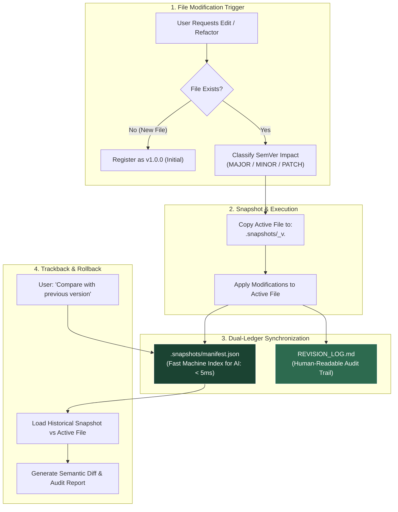
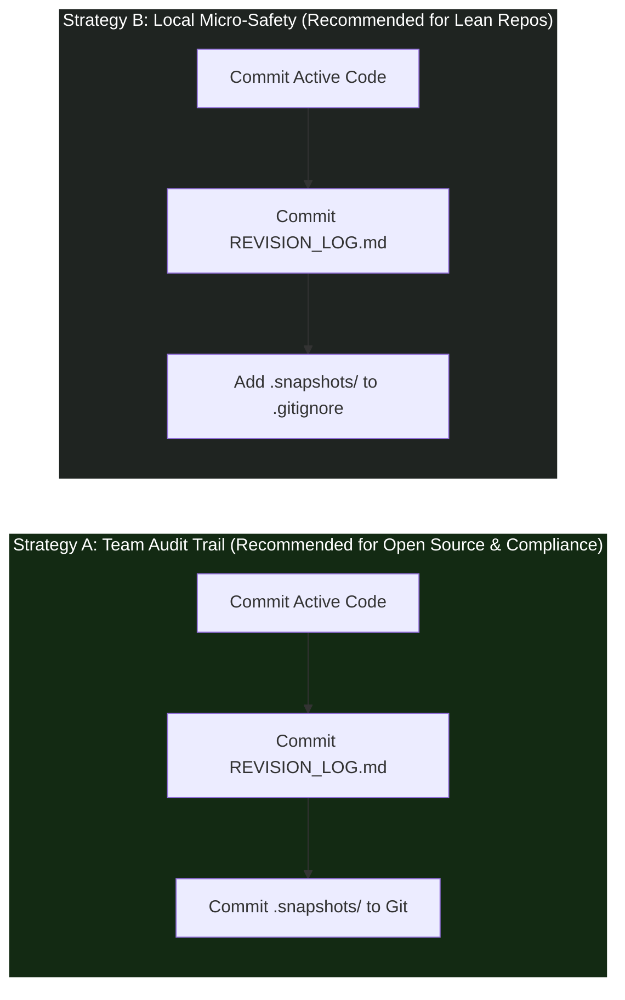

<div align="center">

# 🛡️ Agent-Checkpoint

**Zero-data-loss file snapshotting, SemVer classification, and dual-ledger audit trail for autonomous AI coding & research agents.**

[](./LICENSE)
[]()
[]()
[]()

---

**Languages:**  
[English (Current)](./README.md) • [🇮🇩 Bahasa Indonesia](./README.id.md)

---

</div>

## ⚡ The Problem: Destructive In-Place AI Overwrites

Autonomous AI coding agents (Cursor, Claude Code, Google Antigravity, Windsurf, GitHub Copilot, Aider) are accelerating software development and scientific research. However, almost every agent shares a dangerous default behavior: **they overwrite files in-place without preserving history**.

* ❌ **Silent Regression:** An AI agent refactors a module and inadvertently drops a critical edge case, business constraint, or formula.
* ❌ **Zero Paper Trail:** You return to your workspace without knowing *why* specific architectural decisions or parameter changes were made.
* ❌ **Irreversible Hallucination:** A misunderstood prompt causes the agent to wipe out hours of draft writing, LaTeX formulas, or working code.
* ❌ **Git Micro-Commit Noise:** Developers feel forced to make dozens of messy Git commits just to maintain an undo safety net.

---

## 💡 The Solution: The Agent-Checkpoint Protocol

**Agent-Checkpoint** is an ultra-lightweight, zero-dependency protocol that installs in seconds. It enforces a simple, unbreakable rule on AI agents: **never touch an existing file without archiving its previous state first**, while automatically maintaining an audit ledger explaining *why* the change occurred.

---

## 🌟 Key Benefits

### 1. 🛡️ Absolute Safety (Zero Data Loss)
Before modifying any file, the agent copies its exact prior state into `.snapshots/`. Your working code and drafts are never permanently destroyed or overwritten.

### 2. 📝 Automatic Audit Trail (Living Engineering Journal)
The agent automatically maintains `REVISION_LOG.md`, detailing the **technical and architectural rationale** behind every modification. Ideal for:
* Team code reviews and pull request summaries.
* Post-mortem debugging without guessing what the AI changed overnight.
* Academic and enterprise compliance audit trails.

### 3. 🎯 Zero Dependency & 100% Private
* **No package managers:** Requires no `npm`, `pip`, Docker, or background daemon.
* **100% Local & Offline:** All snapshots and logs remain strictly on your local disk. Zero telemetry or external network calls.

### 4. 🔀 Deep Trackback & Time-Travel
Ask your AI at any time: *"Compare `auth_service.py` with the version before the refactor"* or *"Revert `auth_service.py` back to `v1.0.0`"*. The agent retrieves the snapshot and performs semantic diffs or restorations instantly.

---

## 🏗️ Architecture: Dual-Ledger System



---

## 🔰 Beginner's Quickstart (30-Second Setup)

Installation requires **zero configuration and no command-line tools**. It follows a simple drop-in pattern.

### Option 1: File Explorer / Drag-and-Drop (Easiest)
1. Open the [`adapters/`](./adapters) folder in this repository.
2. Select the single file matching your AI tool:
   * **Cursor IDE:** Copy [`.cursorrules`](./adapters/.cursorrules) to project root, or copy [`agent-checkpoint.mdc`](./adapters/agent-checkpoint.mdc) into `.cursor/rules/` (Cursor 0.40+)
   * **Claude Code:** Copy [`CLAUDE.md`](./adapters/CLAUDE.md)
   * **Google Antigravity / Gemini CLI:**
     - **Project Scope:** Copy [`adapters/AGENTS.md`](./adapters/AGENTS.md) into your project root.
     - **Global Machine Scope (Recommended):** Append [`adapters/AGENTS.md`](./adapters/AGENTS.md) to `~/.gemini/AGENTS.md` (protects all projects automatically!).
     - **Native Skill Scope:** Copy [`SKILL.md`](./SKILL.md) to your Antigravity skills directory (`.agents/skills/agent-checkpoint/SKILL.md` or `~/.gemini/config/plugins/.../skills/agent-checkpoint/`).
   * **Windsurf (Cascade):** Copy [`.windsurfrules`](./adapters/.windsurfrules)
   * **GitHub Copilot:** Copy [`copilot-instructions.md`](./adapters/copilot-instructions.md) into your `.github/` folder
3. Paste the file into your project's root folder.
4. **Done!** Your AI is now governed by the Agent-Checkpoint protocol.

---

### Option 2: 1-Line Terminal Download (`curl`)
Run the command matching your editor inside your project root:

* **Cursor IDE:**
  ```bash
  # Classic .cursorrules:
  curl -o .cursorrules https://raw.githubusercontent.com/ainullm/agent-checkpoint/main/adapters/.cursorrules

  # Or Modern Cursor Rules (.cursor/rules/*.mdc):
  mkdir -p .cursor/rules && curl -o .cursor/rules/agent-checkpoint.mdc https://raw.githubusercontent.com/ainullm/agent-checkpoint/main/adapters/agent-checkpoint.mdc
  ```
* **Claude Code:**
  ```bash
  curl -o CLAUDE.md https://raw.githubusercontent.com/ainullm/agent-checkpoint/main/adapters/CLAUDE.md
  ```
* **Google Antigravity / Gemini CLI:**
  ```bash
  # Project-specific:
  curl -o AGENTS.md https://raw.githubusercontent.com/ainullm/agent-checkpoint/main/adapters/AGENTS.md

  # Or Global (protects all projects on your machine):
  # Linux/macOS:
  curl -s https://raw.githubusercontent.com/ainullm/agent-checkpoint/main/adapters/AGENTS.md >> ~/.gemini/AGENTS.md
  # Windows PowerShell:
  Add-Content -Path "$HOME\.gemini\AGENTS.md" -Value (Invoke-RestMethod "https://raw.githubusercontent.com/ainullm/agent-checkpoint/main/adapters/AGENTS.md")
  ```
* **Windsurf:**
  ```bash
  curl -o .windsurfrules https://raw.githubusercontent.com/ainullm/agent-checkpoint/main/adapters/.windsurfrules
  ```

---

## 🎮 Comprehensive Usage Guide & Real-World Workflows

Once the adapter rule is placed, **there are no special CLI commands or syntax to memorize**. You interact with your AI agent naturally. Here are the 4 standard usage workflows:

---

### Workflow 1: Everyday Feature Addition & Refactoring

**What You Ask Your Agent:**
> *"Refactor `auth_service.py` to support JWT refresh tokens, add rate limiting with Redis, and improve error logging."*

**What the Agent Does Automatically (Behind the Scenes):**
1. **Verifies File State:** Detects that `auth_service.py` already exists at version `v1.0.0`.
2. **Takes Pre-Edit Snapshot:** Copies `auth_service.py` $\to$ `.snapshots/auth_service_v1.0.0.py`.
3. **Triages SemVer Impact:** Evaluates the request. Because new features and parameters were introduced without breaking existing endpoints, it assigns `MINOR` ($\to$ `v1.1.0`).
4. **Applies Edits:** Overwrites `auth_service.py` with the new JWT and rate-limiting code.
5. **Synchronizes Dual-Ledger:**
   * Appends machine entry to `.snapshots/manifest.json`.
   * Appends human entry to `REVISION_LOG.md` detailing exact line ranges and architectural rationale.

---

### Workflow 2: Emergency Rollback (Fixing AI Hallucinations)

If an agent hallucinates, deletes essential business logic, or introduces breaking bugs across prompt iterations:

**What You Ask Your Agent:**
> *"The changes in `auth_service.py` broke our test suite. Please roll back `auth_service.py` to `v1.0.0`."*

**What the Agent Does:**
1. Looks up `v1.0.0` in `.snapshots/manifest.json`.
2. Restores `.snapshots/auth_service_v1.0.0.py` over `auth_service.py`.
3. Logs the rollback event in `REVISION_LOG.md` (e.g., `PATCH: Rolled back auth_service.py from v1.1.0 to v1.0.0 due to test failure`).
4. Your codebase is immediately returned to a clean, working state.

---

### Workflow 3: Deep Trackback & Semantic Diff Inspection

You return to your computer after an agent finished multiple autonomous edits:

**What You Ask Your Agent:**
> *"Trackback: Compare `data_pipeline.py` with the version before the vector optimization. What algorithmic bottlenecks and functions were modified?"*

**What the Agent Does:**
1. Loads the historical snapshot `.snapshots/data_pipeline_v1.0.0.py` and active `data_pipeline.py`.
2. Reads `REVISION_LOG.md` to retrieve the original intent.
3. Produces a concise, semantic Before vs After diff report highlighting modified functions and algorithmic complexity changes without manual git diffing.

---

### Workflow 4: Multi-File Batch Workflows (Composer & Agents)

When using Cursor Composer, Windsurf Cascade, or Claude Code on multi-file prompts:
> *"Implement a new billing checkout flow: update `routes.ts`, `stripe_client.py`, and `database.sql`."*

The protocol executes sequentially per target file:
* `.snapshots/routes_v1.0.0.ts`
* `.snapshots/stripe_client_v1.0.0.py`
* `.snapshots/database_v1.0.0.sql`

Each modified file receives its own independent pre-edit snapshot and synchronized entry in `manifest.json` and `REVISION_LOG.md`.

---

## 🤝 Git Integration Strategies: How to Handle `.snapshots/`

Agent-Checkpoint is designed to complement Git, not replace it. You can choose between two popular collaboration strategies:



* **Strategy A (Full Team Provenance):** Check `.snapshots/` into Git. Teammates pulling the repo can inspect what AI generated, run trackbacks on previous prompts, and review audit trails directly in pull requests.
* **Strategy B (Local Scratchpad):** Add `.snapshots/` to `.gitignore`, but keep `REVISION_LOG.md` committed. You retain 100% rollback protection on your local machine, while keeping remote Git repository size completely lean.

---

## 📂 Resulting Directory Layout

Once active, your project maintains an organized, self-documenting structure:

```text
my-project/
├── .snapshots/                          # Historical snapshots (auto-managed)
│   ├── manifest.json                    # Machine-readable registry (< 5ms read)
│   ├── auth_service_v1.0.0.py           # Preserved pre-edit snapshot
│   └── api_routes_v1.0.0.ts
├── REVISION_LOG.md                      # Human-readable engineering audit trail
├── auth_service.py                      # Active working file (v1.1.0)
└── api_routes.ts                        # Active working file
```

---

## 💾 Storage Economics & Real-World Consumption Scenarios

A common concern with snapshot systems is: *"Will this fill up my hard drive over time?"*  
The short answer is: **No. Plain-text code is exceptionally small, and smart guardrails guarantee zero bloat.**

### 📊 Real-World Usage Scenarios & Storage Math

Below is an empirical simulation assuming an average source code file size of **15 KB** (typical for 300–600 lines of Python, TypeScript, or Go):

| Developer Persona | Daily AI Edits | Avg File Size | Monthly Disk Usage | Yearly Disk Usage | % of 512 GB SSD |
| :--- | :---: | :---: | :---: | :---: | :---: |
| 🧑‍💻 **Casual / Student Dev**<br>*(Part-time projects, homework, occasional scripts)* | ~2 edits/day<br>*(10/week)* | 15 KB | **~0.9 MB** | **~10.8 MB** | `0.002%` |
| 🚀 **Full-Time Software Engineer**<br>*(Active daily feature building, refactoring)* | ~30 edits/day | 15 KB | **~13.5 MB** | **~162 MB** | `0.031%` |
| ⚡ **Heavy AI Pair Programmer**<br>*(Cursor Composer power user, 10+ prompt sessions/day)* | ~100 edits/day | 15 KB | **~45.0 MB** | **~540 MB** | `0.105%` |
| 🤖 **Autonomous Multi-Agent Bot**<br>*(Continuous automated code generation & test loops)* | ~500 edits/day | 15 KB | **~225.0 MB** | **~2.7 GB** | `0.527%` |

> 💡 **Takeaway:** Even a full-time software engineer running 30 AI refactors every day will consume **less than 200 MB in an entire year** — smaller than a single Electron app or a few dependencies in `node_modules/`.

---

### 🛡️ Why Disk Space Will Never Blow Up (3 Safety Pillars)

1. **Microscopic Plain-Text Footprint:** Code files compress and store efficiently. 100 snapshots of a 10 KB file take only 1 MB.
2. **📏 Smart 1 MB Cap on Tabular Data:** Small mock seeds (`.csv`, `.jsonl`, `.tsv`) $\le 1\text{ MB}$ are snapshotted. Datasets $> 1\text{ MB}$ are strictly skipped from raw duplication and logged via metadata only.
3. **🚫 Absolute Exclusion of Binary Bloat:** Heavy machine learning models (`.pt`, `.onnx`, `.safetensors`), binary archives (`.zip`, `.exe`), and dependency caches (`node_modules/`, `venv/`, `__pycache__/`) are **strictly excluded by policy**.

---

### 🧹 Maintenance & Pruning Guide (Freeing Space Anytime)

Because `.snapshots/` contains historical backups rather than runtime code, **pruning or deleting snapshots carries zero risk of breaking your application**.

#### 1. Delete Snapshots Older than 30 Days
* **PowerShell (Windows):**
  ```powershell
  Get-ChildItem -Path .snapshots -File | Where-Object { $_.LastWriteTime -lt (Get-Date).AddDays(-30) -and $_.Name -ne "manifest.json" } | Remove-Item
  ```
* **Bash / Zsh (Linux & macOS):**
  ```bash
  find .snapshots/ -type f ! -name "manifest.json" -mtime +30 -delete
  ```

#### 2. Keep Only the Last 5 Versions Per File
* **Bash / Zsh:**
  ```bash
  # Prunes older snapshot files while preserving manifest.json
  ls -t .snapshots/*_*.* 2>/dev/null | tail -n +15 | xargs -r rm --
  ```

#### 3. Complete Reset (Nuclear Clean)
If a project is finalized and you want to reclaim 100% of snapshot space:
```bash
# Deletes all snapshots and resets the machine ledger
rm -rf .snapshots && mkdir .snapshots && echo "[]" > .snapshots/manifest.json
```

---

## 🌐 Universal File Support (100+ Formats Supported)

Agent-Checkpoint is completely language-agnostic and filetype-agnostic:

* **Programming & Systems:** Python (`.py`), TypeScript (`.ts`, `.tsx`), JavaScript (`.js`, `.jsx`), Go (`.go`), Rust (`.rs`), C/C++ (`.c`, `.cpp`, `.h`, `.hpp`), C# (`.cs`), Java (`.java`), PHP (`.php`), Ruby (`.rb`), Swift (`.swift`), Kotlin (`.kt`), Dart (`.dart`), Scala (`.scala`), Shell (`.sh`, `.bash`, `.zsh`), PowerShell (`.ps1`, `.bat`), Lua (`.lua`), R (`.r`), Julia (`.jl`).
* **Web & Modern Frontend:** HTML (`.html`), CSS (`.css`), SCSS/SASS (`.scss`), Vue (`.vue`), Svelte (`.svelte`), XML (`.xml`), SVG (`.svg`).
* **Data Science & Research:** Jupyter Notebooks (`.ipynb`), Typst (`.typ`), LaTeX (`.tex`, `.bib`, `.sty`), Markdown (`.md`, `.mdx`), RestructuredText (`.rst`), AsciiDoc (`.adoc`), Plain text (`.txt`).
* **Diagrams & Visuals as Code:** Mermaid (`.mmd`, `.mermaid`), PlantUML (`.puml`), Graphviz (`.dot`), Draw.io XML (`.drawio`), Excalidraw JSON (`.excalidraw`).
* **API Schemas & Contracts:** Protobuf (`.proto`), GraphQL (`.graphql`, `.gql`), Prisma (`.prisma`), OpenAPI / Swagger (`.yaml`, `.json`), Apache Thrift (`.thrift`), FlatBuffers (`.fbs`).
* **Game Development & Shaders:** GLSL (`.glsl`, `.frag`, `.vert`), HLSL (`.hlsl`), WGSL (`.wgsl`), Godot GDScript (`.gd`, `.tscn`), Unreal Engine text configs (`.ini`).
* **Hardware & Embedded:** Verilog (`.v`, `.vh`), SystemVerilog (`.sv`), VHDL (`.vhd`), Assembly (`.asm`, `.s`), Arduino (`.ino`), CMake (`CMakeLists.txt`, `.cmake`).
* **DevOps, IaC & Policies:** Open Policy Agent Rego (`.rego`), CUE (`.cue`), Terraform (`.tf`), Kubernetes manifests, Dockerfile, Makefile, JSON, YAML, TOML, SQL (`.sql`).

---

## ⚠️ Known Boundaries (v1.0)

| Limitation | Technical Context | Recommended Mitigation |
| :--- | :--- | :--- |
| **1. Small Model Compliance** | The protocol relies on system prompt instructions. Tier-1 models (Claude 3.5/3.7, GPT-4o, Gemini 2.0 Pro) exhibit **~100% compliance**. Smaller local models (7B/8B) may occasionally omit a snapshot during very long conversation windows. | Use capable reasoning models for major refactoring tasks. |
| **2. Snapshot Sprawl** | If a single file is modified hundreds of times, `.snapshots/` accumulates individual files. Auto-pruning is not yet included in v1.0. | Plain-text files consume minimal storage (~10 MB/month), but periodic manual pruning of old patch versions is recommended using the scripts above. |
| **3. File Deletion & Renaming** | Version 1.0 targets file content edits (`modify`). Deleting a file via terminal (`rm`) is not yet intercepted automatically. | Confirm manual verification before instructing agents to execute permanent file deletions. |
| **4. Multi-File Batch Edits** | Modifying 10 files in a single prompt creates 10 individual log entries rather than a single unified changeset. | Refactor modules in focused, logical increments. |

---

## 📄 License & Community

Distributed under the [MIT License](./LICENSE) — free for personal, academic, and commercial use.

Contributions, pull requests, and feedback are welcome! ⭐ Leave a star if this protocol helps safeguard your workflow.

