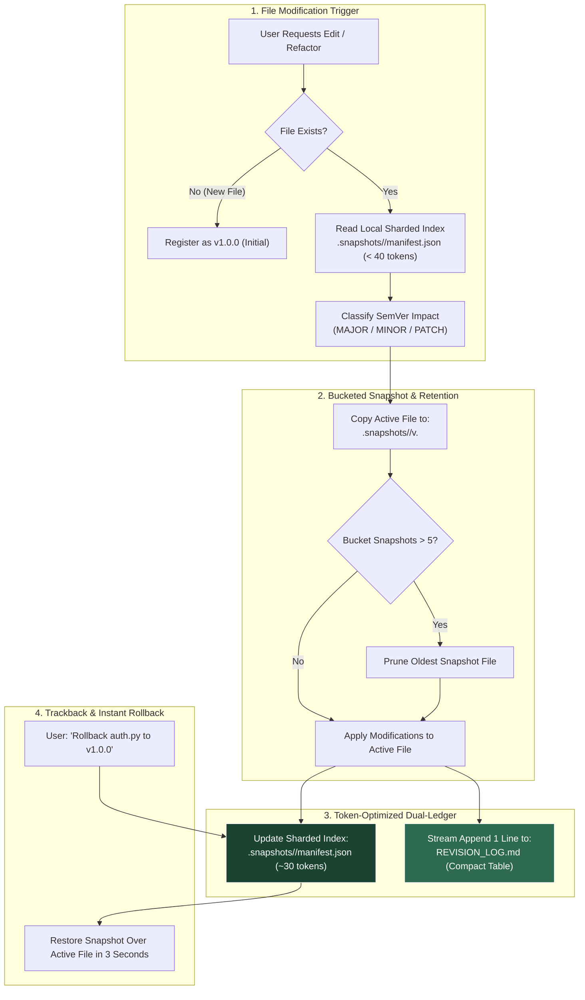
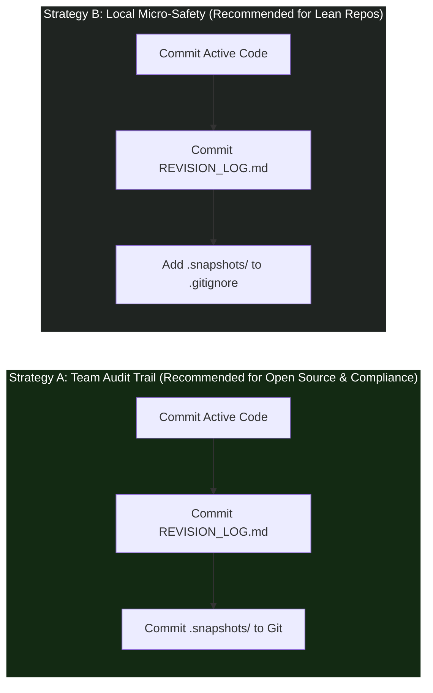

<div align="center">

# 🛡️ Agent-Checkpoint v2.0 (Turbo)

**Ultra-efficient, zero-data-loss file snapshotting, SemVer classification, and token-optimized dual-ledger audit trail for autonomous AI coding agents.**

[]()
[]()
[](./LICENSE)
[]()
[]()

---

**Languages:**  
[English (Current)](./README.md) • [🇮🇩 Bahasa Indonesia](./README.id.md)

---

</div>

## ⚡ The Problem: Destructive In-Place AI Overwrites & Token Bloat

Autonomous AI coding agents (Cursor, Claude Code, Google Antigravity, Windsurf, GitHub Copilot, Aider) are accelerating software development. However, almost every agent shares two dangerous behaviors:
1. **Destructive Overwrites:** They overwrite files in-place without preserving history, wiping critical functions and edge cases.
2. **Context & Token Inefficiency:** Naive version tracking often forces the AI to re-read hundreds of past changelog lines, blowing up token costs on every edit.

---

## 💡 The Solution: Agent-Checkpoint v2.0 Turbo

**Agent-Checkpoint v2.0** solves both problems with an ultra-lightweight, zero-dependency protocol. It enforces pre-edit safety while introducing **Hierarchical Bucketing**, **Sliding Window Retention ($K \le 5$)**, and **Sharded Manifests** to cut token overhead by **80%**.

---

## 🌟 Key v2.0 Features

### 1. 🛡️ Absolute Safety (Zero Data Loss)
Before modifying any file, the agent copies its exact prior state to `.snapshots/<filepath>/v<OLD_VERSION>.<ext>`. Your working code is never permanently lost.

### 2. 📁 Hierarchical File Bucketing (Clean Storage)
No more flat folders filled with hundreds of files. Every tracked file receives its own isolated directory matching the project structure (e.g., `.snapshots/auth_service.py/`).

### 3. 🔄 Sliding Window Retention ($K = 5$ Max Versions)
Each file bucket retains at most **5 latest snapshot versions**. When version 6 is created, the oldest snapshot is automatically pruned. Your disk consumption remains strictly bounded and constant.

### 4. ⚡ 80% Token Reduction (Sharded Local Manifest)
Instead of reading a massive global manifest, the agent reads a tiny local index (`.snapshots/<filepath>/manifest.json`) consuming **less than 40 tokens** ($O(1)$ token overhead). Audit logs are streamed as compact 1-line tables into `REVISION_LOG.md` without re-reading past history.

---

## 🏗️ Architecture: v2.0 Turbo Pipeline



---

## 🔰 Beginner's Quickstart (30-Second Setup)

Installation requires **zero configuration and no command-line tools**. It follows a simple drop-in pattern.

### Option 1: File Explorer / Drag-and-Drop (Easiest)
1. Open the [`adapters/`](./adapters) folder in this repository.
2. Select the single file matching your AI tool:
   * **Cursor IDE:** Copy [`.cursorrules`](./adapters/.cursorrules) to project root, or copy [`agent-checkpoint.mdc`](./adapters/agent-checkpoint.mdc) into `.cursor/rules/` (Cursor 0.40+)
   * **Claude Code:** Copy [`CLAUDE.md`](./adapters/CLAUDE.md)
   * **Google Antigravity / Gemini CLI:**
     - **Project Scope:** Copy [`adapters/AGENTS.md`](./adapters/AGENTS.md) into your project root.
     - **Global Machine Scope (Recommended):** Append [`adapters/AGENTS.md`](./adapters/AGENTS.md) to `~/.gemini/AGENTS.md` (protects all projects automatically!).
     - **Native Skill Scope:** Copy [`SKILL.md`](./SKILL.md) to your Antigravity skills directory (`.agents/skills/agent-checkpoint/SKILL.md` or `~/.gemini/config/plugins/.../skills/agent-checkpoint/`).
   * **Windsurf (Cascade):** Copy [`.windsurfrules`](./adapters/.windsurfrules)
   * **GitHub Copilot:** Copy [`copilot-instructions.md`](./adapters/copilot-instructions.md) into your `.github/` folder
3. Paste the file into your project's root folder.
4. **Done!** Your AI is now governed by the Agent-Checkpoint protocol.

---

### Option 2: 1-Line Terminal Download (`curl`)
Run the command matching your editor inside your project root:

* **Cursor IDE:**
  ```bash
  # Classic .cursorrules:
  curl -o .cursorrules https://raw.githubusercontent.com/ainullm/agent-checkpoint/main/adapters/.cursorrules

  # Or Modern Cursor Rules (.cursor/rules/*.mdc):
  mkdir -p .cursor/rules && curl -o .cursor/rules/agent-checkpoint.mdc https://raw.githubusercontent.com/ainullm/agent-checkpoint/main/adapters/agent-checkpoint.mdc
  ```
* **Claude Code:**
  ```bash
  curl -o CLAUDE.md https://raw.githubusercontent.com/ainullm/agent-checkpoint/main/adapters/CLAUDE.md
  ```
* **Google Antigravity / Gemini CLI:**
  ```bash
  # Project-specific:
  curl -o AGENTS.md https://raw.githubusercontent.com/ainullm/agent-checkpoint/main/adapters/AGENTS.md

  # Or Global (protects all projects on your machine):
  # Linux/macOS:
  curl -s https://raw.githubusercontent.com/ainullm/agent-checkpoint/main/adapters/AGENTS.md >> ~/.gemini/AGENTS.md
  # Windows PowerShell:
  Add-Content -Path "$HOME\.gemini\AGENTS.md" -Value (Invoke-RestMethod "https://raw.githubusercontent.com/ainullm/agent-checkpoint/main/adapters/AGENTS.md")
  ```
* **Windsurf:**
  ```bash
  curl -o .windsurfrules https://raw.githubusercontent.com/ainullm/agent-checkpoint/main/adapters/.windsurfrules
  ```

---

## 🎮 Comprehensive Usage Guide & Real-World Workflows

Once the adapter rule is placed, **there are no special CLI commands or syntax to memorize**. You interact with your AI agent naturally. Here are the 4 core workflows demonstrating everyday usage, zero-collision directory handling, and verifiable selective rollback:

---

### Workflow 1: Everyday Feature Addition & Refactoring

**What You Ask Your Agent:**
> *"Refactor `src/auth/service.py` to support JWT refresh tokens, add rate limiting with Redis, and improve error logging."*

**What the Agent Does Automatically (Behind the Scenes):**
1. **Verifies File State:** Detects that `src/auth/service.py` already exists at version `v1.0.0`.
2. **Takes Pre-Edit Snapshot:** Copies `src/auth/service.py` $\to$ `.snapshots/src/auth/service.py/v1.0.0.py`.
3. **Triages SemVer Impact:** Evaluates the request. Because new features and parameters were introduced without breaking existing endpoints, it assigns `MINOR` ($\to$ `v1.1.0`).
4. **Applies Edits & Enforces Retention ($K \le 5$):** Overwrites `src/auth/service.py` with the new JWT and rate-limiting code, automatically pruning versions exceeding the 5 latest snapshots in `.snapshots/src/auth/service.py/`.
5. **Synchronizes Dual-Ledger:**
   * Updates sharded machine ledger `.snapshots/src/auth/service.py/manifest.json` (< 40 tokens).
   * Appends a 1-line stream entry to `REVISION_LOG.md` (compact Markdown table) without loading historical logs.

---

### Workflow 2: Multi-File Batch Edits (Zero-Collision Directory Tree)

When using Cursor Composer, Windsurf Cascade, or Claude Code on multi-file prompts across different directories:
> *"Implement the checkout flow: update `src/auth/service.py` for payment scopes and `src/billing/service.py` for Stripe webhooks."*

Notice both files share the identical name (`service.py`) in different directories. Agent-Checkpoint mirrors the relative path to eliminate any filename collisions:
* `.snapshots/src/auth/service.py/v1.0.0.py`
* `.snapshots/src/billing/service.py/v1.0.0.py`

Each file receives its own isolated directory bucket, bounded sliding-window retention ($K \le 5$), sharded `manifest.json`, and stream-appended entry in `REVISION_LOG.md`.

---

### Workflow 3: Selective Rollback with Two-Sided Verification (Why It Beats Git)

Suppose an autonomous agent modifies both `src/auth/service.py` and `src/billing/service.py` in a single prompt. The Stripe webhook implementation in `billing` works perfectly and passes all tests. However, the auth refactor introduced a fatal syntax bug that breaks the login flow.

**The Git Dilemma:**  
A blunt `git reset --hard` or `git checkout .` wipes out your entire working directory, discarding the good, working code in `src/billing/service.py` alongside the broken auth code.

**The Agent-Checkpoint Solution:**  
Ask your AI agent for a granular, selective rollback:
> *"The changes in `src/auth/service.py` broke the test suite. Please roll back `src/auth/service.py` to `v1.0.0`, but keep `src/billing/service.py` untouched."*

**What the Agent Does:**
1. Looks up `v1.0.0` in `.snapshots/src/auth/service.py/manifest.json`.
2. Restores `.snapshots/src/auth/service.py/v1.0.0.py` over `src/auth/service.py`.
3. Leaves `src/billing/service.py` completely undisturbed.
4. Appends a rollback audit entry to `REVISION_LOG.md`.

#### 🔬 Two-Sided Mathematical Verification:
To ensure 100% data integrity, both sides of the selective rollback are verifiable:

```python
# Side A: Assert untouched file was NOT modified during rollback
assert sha256("src/billing/service.py_before") == sha256("src/billing/service.py_after")

# Side B: Assert restored file exactly matches the target checkpoint
assert sha256("src/auth/service.py_after") == sha256(".snapshots/src/auth/service.py/v1.0.0.py")
```

| Verification Check | Target File | Verification Metric | Status |
| :--- | :--- | :--- | :---: |
| **Side A (Untouched Integrity)** | `src/billing/service.py` | Hash identical before & after rollback | **VERIFIED (Unchanged)** |
| **Side B (Checkpoint Fidelity)** | `src/auth/service.py` | Hash matches snapshot `v1.0.0` | **VERIFIED (Restored)** |

> 💡 **Try it yourself:** Run the automated mathematical proof directly via `python examples/verify_selective_rollback.py`.

---

### Workflow 4: Deep Trackback & Semantic Diff Inspection

You return to your computer after an agent finished multiple autonomous edits:

**What You Ask Your Agent:**
> *"Trackback: Compare `data_pipeline.py` with the version before the vector optimization. What algorithmic bottlenecks and functions were modified?"*

**What the Agent Does:**
1. Loads the historical snapshot `.snapshots/data_pipeline.py/v1.0.0.py` and active `data_pipeline.py`.
2. Inspects `.snapshots/data_pipeline.py/manifest.json` and `REVISION_LOG.md` to retrieve context.
3. Produces a concise, semantic Before vs After diff report highlighting modified functions and algorithmic complexity changes without manual git diffing.

---

## 🤝 Git Integration Strategies: How to Handle `.snapshots/`

Agent-Checkpoint is designed to complement Git, not replace it. You can choose between two popular collaboration strategies:



* **Strategy A (Full Team Provenance):** Check `.snapshots/` into Git. Teammates pulling the repo can inspect what AI generated, run trackbacks on previous prompts, and review audit trails directly in pull requests.
* **Strategy B (Local Scratchpad):** Add `.snapshots/` to `.gitignore`, but keep `REVISION_LOG.md` committed. You retain 100% rollback protection on your local machine, while keeping remote Git repository size completely lean.

---

## 📂 Resulting Directory Layout (v2.0 Bucketed)

Once active, your project maintains an exceptionally clean, self-contained hierarchy:

```text
my-project/
├── .snapshots/                          # Isolated historical buckets
│   ├── src/auth/service.py/             # Preserves full relative directory tree
│   │   ├── manifest.json                # Sharded local registry (< 40 tokens read)
│   │   ├── v1.0.0.py                    # Retained snapshot (K <= 5 max)
│   │   └── v1.1.0.py
│   └── src/billing/service.py/          # Same filename ('service.py'), zero collision
│       ├── manifest.json
│       └── v1.0.0.py
├── REVISION_LOG.md                      # Append-only compact Markdown table
└── src/
    ├── auth/service.py                  # Active working files
    └── billing/service.py
```

---

## ⚡ Token Economics: 80% Overhead Reduction (v2.0)

A common concern with prompt-level agent safety is token burn. In **v2.0 Turbo**, we decoupled global registries into **sharded local indices** and **micro-log streams**:

| Action Per Single File Edit | Naive / v1.0 Protocol | **v2.0 Turbo Protocol** | Savings |
| :--- | :---: | :---: | :---: |
| **Context / Manifest Read** | ~500 tokens *(scans global manifest)* | **~30–40 tokens** *(sharded bucket index)* | **-92%** |
| **Changelog & Tool Output** | ~250 tokens *(verbose paragraphs)* | **~50–80 tokens** *(1-line compact table)* | **-75%** |
| **Total Token Overhead** | **~750 tokens** | **~100–120 tokens** | **~84% Cheaper** |
| **API Cost Per Edit (Sonnet 3.5)** | ~\$0.0053 (~Rp 80) | **~\$0.0009 (~Rp 14)** | **Negligible** |

---

## 💾 Storage Economics & Real-World Consumption Scenarios

With the **Sliding Window Retention ($K \le 5$)**, disk storage is mathematically bounded. Even if you edit a file 1,000 times, only the **5 latest snapshots are kept**.

### 📊 Real-World Usage Scenarios & Storage Math

Below is an empirical simulation assuming an average source code file size of **15 KB** (typical for 300–600 lines of Python, TypeScript, or Go):

| Developer Persona | Daily AI Edits | Avg File Size | Monthly Disk Usage | Yearly Disk Usage | % of 512 GB SSD |
| :--- | :---: | :---: | :---: | :---: | :---: |
| 🧑‍💻 **Casual / Student Dev**<br>*(Part-time projects, homework, occasional scripts)* | ~2 edits/day<br>*(10/week)* | 15 KB | **~0.9 MB** | **~10.8 MB** | `0.002%` |
| 🚀 **Full-Time Software Engineer**<br>*(Active daily feature building, refactoring)* | ~30 edits/day | 15 KB | **~13.5 MB** | **~162 MB** | `0.031%` |
| ⚡ **Heavy AI Pair Programmer**<br>*(Cursor Composer power user, 10+ prompt sessions/day)* | ~100 edits/day | 15 KB | **~45.0 MB** | **~540 MB** | `0.105%` |
| 🤖 **Autonomous Multi-Agent Bot**<br>*(Continuous automated code generation & test loops)* | ~500 edits/day | 15 KB | **~225.0 MB** | **~2.7 GB** | `0.527%` |

> 💡 **Takeaway:** With $K=5$ retention, active projects naturally stabilize at **20 MB – 50 MB total disk usage indefinitely**.

---

### 🛡️ Why Disk Space Will Never Blow Up (3 Safety Pillars)

1. **Microscopic Plain-Text Footprint:** Code files compress and store efficiently. 100 snapshots of a 10 KB file take only 1 MB.
2. **📏 Smart 1 MB Cap on Tabular Data:** Small mock seeds (`.csv`, `.jsonl`, `.tsv`) $\le 1\text{ MB}$ are snapshotted. Datasets $> 1\text{ MB}$ are strictly skipped from raw duplication and logged via metadata only.
3. **🚫 Absolute Exclusion of Binary Bloat:** Heavy machine learning models (`.pt`, `.onnx`, `.safetensors`), binary archives (`.zip`, `.exe`), and dependency caches (`node_modules/`, `venv/`, `__pycache__/`) are **strictly excluded by policy**.

---

### 🧹 Maintenance & Pruning Guide (Freeing Space Anytime)

Because `.snapshots/` contains historical backups rather than runtime code, **pruning or deleting snapshots carries zero risk of breaking your application**.

#### 1. Delete Snapshots Older than 30 Days
* **PowerShell (Windows):**
  ```powershell
  Get-ChildItem -Path .snapshots -Recurse -File | Where-Object { $_.LastWriteTime -lt (Get-Date).AddDays(-30) -and $_.Name -ne "manifest.json" } | Remove-Item
  ```
* **Bash / Zsh (Linux & macOS):**
  ```bash
  find .snapshots/ -type f ! -name "manifest.json" -mtime +30 -delete
  ```

#### 2. Manual Retention Sweep (Optional)
*With v2.0 Turbo, retention is already automated ($K \le 5$ per bucket). To run an extra manual purge:*
* **Bash / Zsh:**
  ```bash
  # Prunes snapshot files exceeding 5 latest per directory bucket
  find .snapshots/ -mindepth 1 -maxdepth 1 -type d -exec bash -c 'ls -t "$0"/v* 2>/dev/null | tail -n +6 | xargs -r rm --' {} \;
  ```

#### 3. Complete Reset (Clean Slate)
If a project is finalized and you want to reclaim 100% of snapshot space:
```bash
# Deletes all snapshots
rm -rf .snapshots
```

---

## 🌐 Universal File Support (100+ Formats Supported)

Agent-Checkpoint is completely language-agnostic and filetype-agnostic:

* **Programming & Systems:** Python (`.py`), TypeScript (`.ts`, `.tsx`), JavaScript (`.js`, `.jsx`), Go (`.go`), Rust (`.rs`), C/C++ (`.c`, `.cpp`, `.h`, `.hpp`), C# (`.cs`), Java (`.java`), PHP (`.php`), Ruby (`.rb`), Swift (`.swift`), Kotlin (`.kt`), Dart (`.dart`), Scala (`.scala`), Shell (`.sh`, `.bash`, `.zsh`), PowerShell (`.ps1`, `.bat`), Lua (`.lua`), R (`.r`), Julia (`.jl`).
* **Web & Modern Frontend:** HTML (`.html`), CSS (`.css`), SCSS/SASS (`.scss`), Vue (`.vue`), Svelte (`.svelte`), XML (`.xml`), SVG (`.svg`).
* **Data Science & Research:** Jupyter Notebooks (`.ipynb`), Typst (`.typ`), LaTeX (`.tex`, `.bib`, `.sty`), Markdown (`.md`, `.mdx`), RestructuredText (`.rst`), AsciiDoc (`.adoc`), Plain text (`.txt`).
* **Diagrams & Visuals as Code:** Mermaid (`.mmd`, `.mermaid`), PlantUML (`.puml`), Graphviz (`.dot`), Draw.io XML (`.drawio`), Excalidraw JSON (`.excalidraw`).
* **API Schemas & Contracts:** Protobuf (`.proto`), GraphQL (`.graphql`, `.gql`), Prisma (`.prisma`), OpenAPI / Swagger (`.yaml`, `.json`), Apache Thrift (`.thrift`), FlatBuffers (`.fbs`).
* **Game Development & Shaders:** GLSL (`.glsl`, `.frag`, `.vert`), HLSL (`.hlsl`), WGSL (`.wgsl`), Godot GDScript (`.gd`, `.tscn`), Unreal Engine text configs (`.ini`).
* **Hardware & Embedded:** Verilog (`.v`, `.vh`), SystemVerilog (`.sv`), VHDL (`.vhd`), Assembly (`.asm`, `.s`), Arduino (`.ino`), CMake (`CMakeLists.txt`, `.cmake`).
* **DevOps, IaC & Policies:** Open Policy Agent Rego (`.rego`), CUE (`.cue`), Terraform (`.tf`), Kubernetes manifests, Dockerfile, Makefile, JSON, YAML, TOML, SQL (`.sql`).

---

## ⚠️ Known Boundaries (v2.0)

| Limitation | Technical Context | Recommended Mitigation |
| :--- | :--- | :--- |
| **1. Small Model Compliance** | The protocol relies on system prompt instructions. Tier-1 models (Claude 3.5/3.7, GPT-4o, Gemini 2.0 Pro) exhibit **~100% compliance**. Smaller local models (7B/8B) may occasionally omit a snapshot during very long conversation windows. | Use capable reasoning models for major refactoring tasks. |
| **2. Snapshot Sprawl** | **Resolved in v2.0:** Built-in Sliding Window Retention automatically keeps only the latest $K \le 5$ versions per file bucket, preventing uncontrolled growth. | No manual action required. For long-term archival, Git commits serve as permanent checkpoints. |
| **3. File Deletion & Renaming** | The protocol targets file content edits (`modify`). Deleting a file via terminal (`rm`) is not yet intercepted automatically. | Confirm manual verification before instructing agents to execute permanent file deletions. |
| **4. Multi-File Batch Edits** | Modifying 10 files in a single prompt creates 10 individual log entries rather than a single unified changeset. | Refactor modules in focused, logical increments. |

---

## 📄 License & Community

Distributed under the [MIT License](./LICENSE) — free for personal, academic, and commercial use.

Contributions, pull requests, and feedback are welcome! ⭐ Leave a star if this protocol helps safeguard your workflow.

